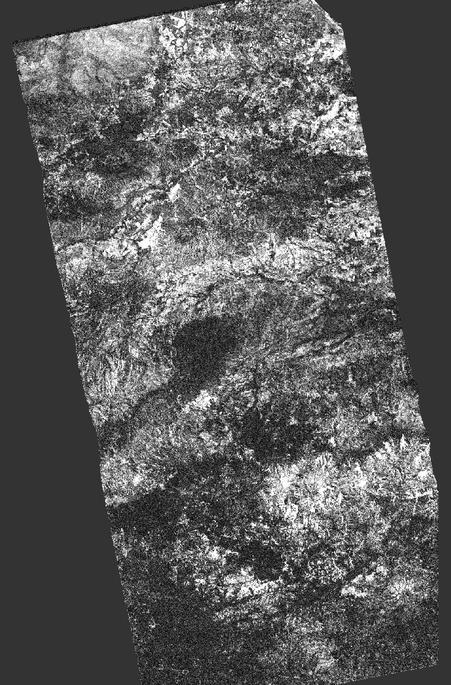

# GSLC Terrain Correction — User Tutorial

**Geocoded, phase-preserving InSAR of the 2026 Venezuela earthquake, in SNAP Desktop and from the command line.**

*This is a hands-on tutorial built on a real Sentinel-1 pair. For the algorithm and the design rationale, read the companion `GSLC-Geocoding-Explained.md`.*

---

## Scenario

On **24 June 2026** an earthquake **doublet** struck northern Venezuela: **Mw 7.2 at 18:04:33 local** (22:04:33 UTC), followed just **39 seconds later** by the **Mw 7.5 mainshock at 18:05:11 local** (22:05:11 UTC), on the right-lateral **San Sebastián fault**. To map the coseismic deformation with the **GSLC** (Geocoded SLC) approach we need an interferometric **pair** — one acquisition before the event and one after:

| Role | Satellite | Acquisition (local / UTC) | Timing vs mainshock |
|------|-----------|---------------------------|---------------------|
| **Reference** (pre-event) | Sentinel-1A | **23 Jun 2026, 18:50:50 / 22:50:50** | ~23.2 h before |
| **Secondary** (post-event) | Sentinel-1C | **24 Jun 2026, 18:49:58 / 22:49:58** | **~45 min after** |

> **Two products, not three.** GSLC InSAR is ordinary *pairwise* interferometry: one reference + one secondary = one interferogram, so **two products** are enough. (This is the key difference from the Phase Linking tutorial, whose distributed-scatterer covariance needs **≥ 3** epochs.) The pair is chosen for the event timing, and the timing here is exceptional: S1C acquired the same track (**relative orbit 106** — shared by S1A, S1C and S1D) just **44 minutes 47 seconds after the mainshock**. S1A the evening before + S1C 45 minutes after therefore bracket the event about as tightly as Sentinel-1 permits: an almost purely **coseismic** pair with a **1-day temporal baseline**, which keeps coherence high even over the tropical vegetation of the epicentral region, and which captures the displacement field before any appreciable afterslip has accumulated. (The 30 Jun *S1D* acquisition makes a good optional **post-seismic** pair against S1C — see the note at the end.)

Download the two products (free, by name) from the **Copernicus Data Space Ecosystem** (<https://dataspace.copernicus.eu>) or **ASF Vertex** (<https://search.asf.alaska.edu>) into a working folder. We process polarisation **VV**, subswath **IW3**. The full product names:

```text
S1A_IW_SLC__1SDV_20260623T225050_20260623T225120_065103_0834C8_BAD5.SAFE
S1C_IW_SLC__1SDV_20260624T224958_20260624T225025_008254_010515_304A.SAFE
```

The pair brackets the earthquake by about a day before and 45 minutes after, so the interferometric phase carries essentially pure coseismic ground displacement, with only the first ~45 minutes of afterslip included. Much of the affected terrain is rural; GSLC's phase-preserving geocoding puts both scenes on a common map grid so the deformation fringes can be formed and interpreted directly.

> **Where the scene sits relative to the rupture.** Read from the interferogram's own geocoding, the scene spans **lon −69.206 … −68.156, lat 9.619 … 11.443** (≈ 115 km E–W × 202 km N–S). The doublet's epicentre (**10.435° N, 68.472° W**) therefore falls **inside** the scene — about 34 km from the eastern edge and 80 km from the western one — so the epicentral zone is imaged directly. The rupture extends ~200 km along the San Sebastián fault, so it does run out of the scene to the east; the eastern part of the fault is not covered. Published finite-fault models (USGS, INGV, Peking University) put maximum slip at 3.6–4.5 m.

## What you will do

1. Generate the **reference GSLC** from S1A (IW3 / VV) — a phase-preserving, geocoded complex image, optionally **ETAD-corrected** first.
2. Feed the **raw secondary** (S1C) together with the reference GSLC to **`CreateStack`**, which auto-coregisters it onto the reference grid.
3. Form the **interferogram** (removing flat-earth **and** topographic phase) and filter it.
4. **Unwrap** with SNAPHU and convert to a coseismic displacement map — already geocoded, so no terrain correction is needed afterwards.

You will do it in the **SNAP Desktop** GUI and with **`gpt`** on the command line.

## Why use it

Traditional terrain correction geocodes amplitude and discards phase, so the classical InSAR chain stays in slant range through a long pipeline (Back-Geocoding → ESD → Interferogram → Deburst → Merge → Terrain-Correction) and geocodes last. **GSLC geocodes up front, preserving phase**, so each acquisition becomes a phase-preserving complex product on a **common map grid**. The benefits: fewer steps (no deburst/merge/separate TC), each scene processed independently and in parallel, and coregistration folded into `CreateStack`. It is the "geocode-first" architecture behind global-scale InSAR systems.

## Prerequisites

- **SNAP 14+** with the SNAP Microwave Toolbox. Confirm the operator:
  ```
  gpt GSLC-Terrain-Correction -h
  ```
- The two Sentinel-1 SLC products above, downloaded to a working folder. SNAP reads either the unzipped `.SAFE` folder or the `.zip` directly.
- **Sentinel-1 IW** input must be a **single subswath from `TOPSAR-Split`** (burst-level). **Debursted** TOPS is **rejected**; **GRD** has no phase and is not usable. (Stripmap SLC — e.g. S-1 SM, ENVISAT ASAR IMS — is a direct input after `Apply-Orbit-File`.)
- Internet access for auto-downloaded precise orbits and the **Copernicus 30 m DEM**.

---

## Part A — SNAP Desktop (GUI)

### A1. Generate the reference GSLC (S1A, IW3 / VV)

1. **Prepare the input.** *File ▸ Open Product…* the S1A `.SAFE`, then **Radar ▸ Apply Orbit File**, then **Radar ▸ Sentinel-1 TOPS ▸ S-1 TOPS Split** and select **IW3** + **VV**.
2. **(Optional but recommended) Apply ETAD.** Menu **Radar ▸ Sentinel-1 TOPS ▸ S-1 ETAD Correction**, with the split product as source. See *A1b* below — do this **before** geocoding.
3. **Launch GSLC.** Menu **Radar ▸ Geometric ▸ Terrain Correction ▸ Geocoded SLC Terrain Correction** (dialog title *"GSLC Terrain Correction"*).
4. **I/O Parameters tab.** Source = the orbit-applied, split (and optionally ETAD-corrected) S1A product; target name gets suffix `_GSLC`; keep `BEAM-DIMAP`.
5. **Processing Parameters tab.** The fields that matter:

   | Field | Default | Notes |
   |-------|---------|-------|
   | Digital Elevation Model | Copernicus 30m Global | Auto-download; or point *External DEM* at a local file |
   | Image Resampling Method | BiSinc 5-point | **Keep a sinc kernel for InSAR** phase fidelity |
   | Pixel Spacing (m / deg) | 0 (auto) | Set explicitly to lock resolution across the pair; becomes the **east** step when a north spacing is also set |
   | Pixel Spacing North (m / deg) | 0 (square) | Optional **rectangular cells** to preserve the SLC's anisotropic native resolution (S1 IW ≈ 3.4 m ground range × 14 m azimuth → set ≈ 3.4 m east × 7.5 m north; the north step must be finer than native azimuth because the orbit heading rotates the radar axes from the map axes). Leave 0 for square cells |
   | Map Projection | WGS84(DD) | Any WKT CRS; use UTM for a metric grid |
   | Output phase-flattened complex data | **false** | **Leave false for InSAR.** True only for amplitude/PolSAR single-date use |
   | Restore TOPS azimuth carrier | **false** | **Leave false.** The carrier is acquisition-specific and does not cancel between acquisitions — restoring it corrupts cross-acquisition InSAR (~tens of spurious fringes per burst) |
   | Apply Solid Earth Tide / Tropospheric | off | Turn on for displacement-grade (sub-decimetre) InSAR |

6. **Run.** The `S1A…_GSLC` product is a phase-preserving complex image on the map grid.

### A1b. ETAD correction (optional, recommended for displacement work)

**ETAD** supplies per-pixel range and azimuth timing corrections — tropospheric and ionospheric path
delay, solid-Earth geodetic effects, bistatic and FM-mismatch azimuth shifts. It moves geolocation by
centimetres to decimetres, which is small in amplitude terms but not in phase terms: one C-band range
fringe is 2.77 cm.

Open **Radar ▸ Sentinel-1 TOPS ▸ S-1 ETAD Correction** with the **split** product as source (before
GSLC — the corrections are defined in radar timing and must be applied in radar geometry).

| Field | Setting | Notes |
|-------|---------|-------|
| ETAD product | *(leave empty)* | Found and downloaded automatically. Requires **Copernicus Data Space credentials** stored in SNAP — see the note below. Browse to a local `S1*_ETA_*.SAFE` to override |
| Resampling Type | BiSinc 5-point | Match the kernel used for GSLC |
| Resampling Image | ✔ on | Off switches to the classical InSAR mode (i/q passed through, corrections emitted as grids) |
| **Output Phase Corrections** | ✔ **ON for InSAR** (default off) | **Essential.** See the note below — without it the atmospheric delay stays in the phase |
| Sum Of Range Corrections | ✔ **on** (default) | The **total** range correction — tropospheric and ionospheric delay included |
| Sum Of Azimuth Corrections | ✔ **on** (default) | The total azimuth correction |
| Individual layers (Tropospheric / Ionospheric / Geodetic / Doppler / Bistatic / FM Mismatch) | all **off** (default) | Only for isolating one contribution when studying it |

> **Tick *Output Phase Corrections* — resampling alone does not correct InSAR phase.** An atmospheric
> delay Δr does two things: it makes the target *appear* at range R + Δr, and it adds −4πΔr/λ to the
> phase the pixel carries. Resampling the image moves the pixel back to R but leaves that phase
> untouched, so the differential term survives into the interferogram in full. With *Output Phase
> Corrections* on, the range-delay phase is removed from the complex samples themselves, which is what
> you want for a geocoded chain — the correction is then baked in before geocoding and carried through
> automatically.
>
> This matters specifically for GSLC: `InterferogramOp`'s ETAD handling runs only on the classical
> (slant-range) paths, so a geocoded stack cannot subtract ETAD grids downstream. The correction has to
> be applied to the complex data up front.

> **The defaults are not "no corrections".** The two *Sum Of…* boxes are ticked by default and already
> contain the total correction. The seven individual checkboxes are unticked, which does **not** mean
> nothing is applied — they select a *subset*, and you would tick one only after unticking the sums.

> **Credentials for auto-download.** The search authenticates against the Copernicus Data Space. Set
> them once under **Tools ▸ Options ▸ General ▸ Credentials** (the same ones the Product Library uses).
> Without them the operator reports `ETAD product not found` even when a product exists.

> **Keep the original product name.** ETAD matches the SAR product to the ETAD product using the
> sensing start/stop timestamps *in the product name*. If you rename an intermediate to something short
> (`my_subset`), correction fails with an opaque `Range [17, 55) out of bounds for length N`. Appending
> a suffix is fine — `S1A_IW_SLC__1SDV_20260623T225050_…_split` works.

> **Apply to both acquisitions, or to neither.** A stack mixing an ETAD-corrected reference with an
> uncorrected secondary puts the differential timing correction straight into the interferometric phase.
> Since `CreateStack` rebuilds a raw secondary from the reference's settings, the clean way to use ETAD
> is to correct and geocode **both** legs yourself, then stack two GSLCs.

> **Do not combine with GSLC's own tropospheric option.** ETAD's tropospheric layer and GSLC's
> `Apply Tropospheric Correction` model the same delay — enabling both double-counts it. ETAD is the
> measured estimate and is preferred where a product exists; the same applies to ETAD's geodetic layers
> versus *Apply Solid Earth Tide*.

### A2. Build the coseismic interferogram (reference GSLC + raw secondary)

You only geocode the **reference** explicitly; `CreateStack` auto-coregisters the raw secondary.

1. **Prepare the secondary.** Apply-Orbit-File + TOPSAR-Split (**IW3**, **VV**) to **S1C**, but **do not** run GSLC on it.
2. **Create Stack** — *Radar ▸ Coregistration ▸ Stack Tools ▸ Create Stack*: add the **reference GSLC** (S1A) and the **raw split secondary** (S1C). CreateStack reads the reference's `gslc_source_slc_path` stamp, cross-correlates against the secondary to estimate the (Δrange, Δazimuth) bias, rebuilds the secondary GSLC with that bias, and stacks the two on the reference grid.
3. **Interferogram Formation** — *Radar ▸ Interferometric ▸ Products ▸ Interferogram Formation*. In *Processing Parameters*:
   - Keep **Subtract flat-earth phase** ticked.
   - **✔ Tick "Subtract topographic phase".** This simulates the topographic fringes from the DEM and removes them, so the interferogram shows **deformation + residual atmosphere** rather than topography — essential for reading the coseismic signal.
   - **✔ Tick "Subtract Residual Ramp (GSLC)".** Cross-acquisition GSLC interferograms carry a smooth residual ramp (~1 fringe per 80 px) from small differences between the two acquisitions' Doppler annotations — the GSLC-domain analogue of why classical TOPS InSAR needs ESD. This option estimates it robustly (a low-order polynomial fitted to block-wise fringe gradients, too rigid to absorb the localized earthquake signal) and removes it. Without it the ramp survives into unwrapping. Caveat: like classical orbital deramping, it would also absorb a genuine *scene-wide linear* deformation gradient.
   - Keep **Include coherence** ticked.
4. **Goldstein Phase Filtering** → **SnaphuExport → SNAPHU → SnaphuImport** (unwrap) → **Phase to Displacement** (line-of-sight displacement in metres).

   Because the GSLC pair is **already geocoded**, the displacement map is already in map coordinates — **no final Range-Doppler Terrain Correction is needed** (one fewer step than the traditional chain).

> **Consistency rule:** reference and secondary must share the **same** `Output phase-flattened` setting **and** the same `Restore TOPS azimuth carrier` setting (leave the latter at its default, off — restoring the carrier corrupts cross-acquisition interferograms with tens of spurious fringes per burst). Mixing conventions yields a meaningless (noise) interferogram. The CreateStack auto-coregister path enforces both from the reference's metadata stamps.

---

## Part B — Command line (`gpt`)

Run these from your working folder; the graphs take the input products as parameters, so no paths are hard-coded.

### Step 1 — generate the reference GSLC (S1A)

Save as `gslc_reference.xml`:

```xml
<graph id="GSLC-Reference">
  <version>1.0</version>
  <node id="Read"><operator>Read</operator><sources/>
    <parameters><file>${s1a}</file></parameters>
  </node>
  <node id="Apply-Orbit-File"><operator>Apply-Orbit-File</operator>
    <sources><sourceProduct refid="Read"/></sources>
    <parameters><orbitType>Sentinel Precise (Auto Download)</orbitType><continueOnFail>false</continueOnFail></parameters>
  </node>
  <node id="TOPSAR-Split"><operator>TOPSAR-Split</operator>
    <sources><sourceProduct refid="Apply-Orbit-File"/></sources>
    <parameters><subswath>IW3</subswath><selectedPolarisations>VV</selectedPolarisations></parameters>
  </node>
  <node id="GSLC-Terrain-Correction"><operator>GSLC-Terrain-Correction</operator>
    <sources><sourceProduct refid="TOPSAR-Split"/></sources>
    <parameters>
      <demName>Copernicus 30m Global DEM</demName>
      <imgResamplingMethod>BISINC_5_POINT_INTERPOLATION</imgResamplingMethod>
      <pixelSpacingInMeter>0</pixelSpacingInMeter>
      <mapProjection>WGS84(DD)</mapProjection>
      <outputFlattened>false</outputFlattened>
      <applySolidEarthTide>false</applySolidEarthTide>
      <applyTroposphericCorrection>false</applyTroposphericCorrection>
    </parameters>
  </node>
  <node id="Write"><operator>Write</operator>
    <sources><sourceProduct refid="GSLC-Terrain-Correction"/></sources>
    <parameters><file>${output}</file><formatName>BEAM-DIMAP</formatName></parameters>
  </node>
</graph>
```

```
gpt gslc_reference.xml ^
    -Ps1a=S1A_IW_SLC__1SDV_20260623T225050_20260623T225120_065103_0834C8_BAD5.SAFE ^
    -Poutput=S1A_GSLC.dim -c 12G -q 8
```

For **displacement-grade** work, add `-PapplySolidEarthTide=true -PapplyTroposphericCorrection=true` (and use the **same** setting for the secondary, which CreateStack rebuilds from the reference's stamp).

#### Step 1b (optional but recommended) — ETAD correction

**ETAD** (Extended Timing Annotation Dataset) is an auxiliary Sentinel-1 product that supplies per-pixel
range and azimuth timing corrections — tropospheric and ionospheric path delay, solid-Earth geodetic
effects, bistatic and FM-mismatch azimuth shifts. Applying it moves geolocation by **centimetres to
decimetres**, which is small in amplitude terms but *not* small in phase terms: at C-band one range
fringe is only 2.77 cm of line-of-sight.

ETAD belongs **on the split SLC, before geocoding** — the corrections are defined in radar timing, so
they must be applied while the product is still in radar geometry:

```
Read → Apply-Orbit-File → TOPSAR-Split → S1-ETAD-Correction → GSLC-Terrain-Correction
```

Insert this node between `TOPSAR-Split` and `GSLC-Terrain-Correction` in `gslc_reference.xml`:

```xml
  <node id="S1-ETAD-Correction"><operator>S1-ETAD-Correction</operator>
    <sources><sourceProduct refid="TOPSAR-Split"/></sources>
    <parameters>
      <resamplingType>BISINC_5_POINT_INTERPOLATION</resamplingType>
      <resamplingImage>true</resamplingImage>
      <!-- essential for InSAR: removes the range-delay phase from the complex data.
           Without it, resampling fixes geolocation but leaves the atmospheric phase in place. -->
      <outputPhaseCorrections>true</outputPhaseCorrections>
      <sumOfRangeCorrections>true</sumOfRangeCorrections>
      <sumOfAzimuthCorrections>true</sumOfAzimuthCorrections>
    </parameters>
  </node>
```

then point `GSLC-Terrain-Correction`'s source at `S1-ETAD-Correction`. That is the whole change — the
command line is unchanged:

```
gpt gslc_reference.xml -Ps1a=…SAFE -Poutput=S1A_GSLC.dim -c 12G -q 8
```

> **The ETAD product is found and downloaded automatically.** Leave `etadFile` unset and the operator
> searches the Copernicus Data Space for the ETAD product matching the acquisition and downloads it to
> SNAP's cache (`<cache>/etad`). This requires **Copernicus Data Space credentials stored in SNAP**
> (*Tools → Manage External Tools / Product Library credentials* — the same ones used for product
> download); without them the search cannot authenticate. If a product is genuinely unavailable the
> operator fails with `ETAD product not found`. You can still pass `etadFile` explicitly to use a local
> product.

> **What the defaults actually do.** `sumOfRangeCorrections` and `sumOfAzimuthCorrections` default to
> **`true`**, while every individual layer (`troposphericCorrectionRg`, `ionosphericCorrectionRg`,
> `geodeticCorrectionRg`, `dopplerShiftCorrectionRg`, `geodeticCorrectionAz`,
> `bistaticShiftCorrectionAz`, `fmMismatchCorrectionAz`) defaults to **`false`**. That is *not* "no
> corrections applied" — the summed layers already contain the total range and azimuth correction,
> tropospheric and ionospheric delay included. The individual switches exist to apply a **subset**,
> which is what you want only when isolating one contribution for study.

> **Apply ETAD to both acquisitions, or to neither.** A stack mixing an ETAD-corrected reference with an
> uncorrected secondary puts the differential timing correction straight into the interferometric phase.
> When `CreateStack` auto-geocodes a raw secondary it rebuilds it from the reference's stamps, so if you
> ETAD-correct the reference you should ETAD-correct the secondary and geocode it yourself, then stack
> two GSLCs (see the all-GSLC note in *Next steps*).

> **Do not use ETAD together with GSLC's own `applyTroposphericCorrection`.** Both model the same
> tropospheric path delay, so enabling both double-counts it. Choose one: ETAD (measured, from the
> auxiliary product) or GSLC's Saastamoinen model (computed). ETAD is the better estimate where an ETAD
> product exists. `applySolidEarthTide` overlaps with ETAD's geodetic layers in the same way.

### Step 2 — GSLC interferogram, end to end

`reference GSLC + raw secondary (S1C) → CreateStack (auto-coregister) → Interferogram (flat-earth + topo removed) → Goldstein → Write`. Save as `gslc_insar.xml`:

```xml
<graph id="GSLC-InSAR">
  <version>1.0</version>
  <node id="ReadReference"><operator>Read</operator><sources/>
    <parameters><file>${reference_gslc}</file></parameters>
  </node>

  <!-- raw secondary: orbit + split only (NOT geocoded); CreateStack geocodes it -->
  <node id="ReadSecondary"><operator>Read</operator><sources/>
    <parameters><file>${secondary}</file></parameters>
  </node>
  <node id="OrbitSecondary"><operator>Apply-Orbit-File</operator>
    <sources><sourceProduct refid="ReadSecondary"/></sources>
    <parameters><orbitType>Sentinel Precise (Auto Download)</orbitType><continueOnFail>false</continueOnFail></parameters>
  </node>
  <node id="SplitSecondary"><operator>TOPSAR-Split</operator>
    <sources><sourceProduct refid="OrbitSecondary"/></sources>
    <parameters><subswath>IW3</subswath><selectedPolarisations>VV</selectedPolarisations></parameters>
  </node>

  <node id="CreateStack"><operator>CreateStack</operator>
    <sources>
      <sourceProduct refid="ReadReference"/>
      <sourceProduct.1 refid="SplitSecondary"/>
    </sources>
    <parameters><resamplingType>NONE</resamplingType></parameters>
  </node>
  <node id="Interferogram"><operator>Interferogram</operator>
    <sources><sourceProduct refid="CreateStack"/></sources>
    <parameters>
      <subtractFlatEarthPhase>true</subtractFlatEarthPhase>
      <subtractTopographicPhase>true</subtractTopographicPhase>
      <subtractResidualRamp>true</subtractResidualRamp>
      <demName>Copernicus 30m Global DEM</demName>
      <includeCoherence>true</includeCoherence>
    </parameters>
  </node>
  <node id="GoldsteinPhaseFiltering"><operator>GoldsteinPhaseFiltering</operator>
    <sources><sourceProduct refid="Interferogram"/></sources>
    <parameters/>
  </node>
  <node id="Write"><operator>Write</operator>
    <sources><sourceProduct refid="GoldsteinPhaseFiltering"/></sources>
    <parameters><file>${output}</file><formatName>BEAM-DIMAP</formatName></parameters>
  </node>
</graph>
```

```
gpt gslc_insar.xml ^
    -Preference_gslc=S1A_GSLC.dim ^
    -Psecondary=S1C_IW_SLC__1SDV_20260624T224958_20260624T225025_008254_010515_304A.SAFE ^
    -Poutput=ifg_GSLC.dim -c 12G -q 8
```

The **`subtractTopographicPhase`** flag is the command-line equivalent of the *Subtract topographic phase* checkbox — it removes the DEM-simulated topographic fringes so the coseismic deformation signal remains. **`subtractResidualRamp`** removes the smooth residual ramp specific to cross-acquisition GSLC interferometry (~1 fringe per 80 px, from small differences in the two acquisitions' Doppler annotations); enable it for visualization and unwrapping, but be aware that — like classical orbital deramping — it would also absorb a genuine scene-wide linear deformation gradient.

### Step 3 — Unwrap to displacement (SNAPHU)

The interferogram phase is *wrapped* into (−π, π]. Converting it to displacement needs **unwrapping**,
done by the external **SNAPHU** program via export → run → import. Because a GSLC interferogram is
already geocoded, the unwrapped result is a displacement map in map coordinates with no further
terrain correction.

**1. Get the SNAPHU binary.** `Radar → Interferometric → Unwrapping → Batch Snaphu Unwrapping`
downloads it for you; the direct URLs are **Windows 64-bit: v2.0.4**
(`step.esa.int/thirdparties/snaphu/2.0.4/snaphu-v2.0.4_win64.zip`), Windows 32-bit and Linux/macOS:
v1.4.2 (`.../snaphu/1.4.2-2/…`). Keep the extracted `bin/` directory intact — on Windows `snaphu.exe`
needs the `msys-2.0.dll` shipped beside it.

**2. Export.**

```
gpt SnaphuExport -Ssource=ifg_GSLC.dim -PtargetFolder=snaphu_out ^
    -PstatCostMode=DEFO -PinitMethod=MST ^
    -PnumberOfTileRows=6 -PnumberOfTileCols=4 -PnumberOfProcessors=8 ^
    -ProwOverlap=400 -PcolOverlap=400 -PtileCostThreshold=500
```

> **`SnaphuExport` needs a band whose unit is `phase`** — not i/q. It ignores the complex bands and
> looks for a phase band plus a coherence band, so a product carrying only `i_`, `q_` and `coh_` fails
> with `Wrapped phase band required`. The interferogram written by Step 2 has the virtual
> `Phase_ifg_…` band and works as-is; the trap appears if you `Subset` first and select only the
> complex bands. Include the `Phase_…` band in the subset (its `atan2(q,i)` expression needs `i_`/`q_`
> present too).

**3. Run SNAPHU** from the created folder, using the command SNAP writes into line 7 of `snaphu.conf`
(the last argument is the raster **width**):

```
cd snaphu_out/ifg_GSLC
snaphu -f snaphu.conf Phase_ifg_IW3_VV_23Jun2026_24Jun2026.snaphu.img 4000
```

**4. Import** the result, then convert to displacement:

```
gpt SnaphuImport -SsnaphuPhase=snaphu_out/ifg_GSLC/UnwPhase_….snaphu.hdr ^
    -Swrapped=ifg_GSLC.dim -t unw_GSLC.dim
gpt PhaseToDisplacement -Ssource=unw_GSLC.dim -t disp_GSLC.dim
```

#### Practical limits worth knowing before you start

- **Multilook before unwrapping — it helps, substantially.** At single-look the interferogram is
  noise-dominated (median coherence 0.23 on this pair), and unwrapping low-coherence data is where
  SNAPHU goes wrong. Multilooking to roughly **8 × 8 (≈110 m cells)** on this scene raised the
  coherence estimate from **0.23 to 0.67**, made the field small enough to unwrap in **a single tile**,
  and cut runtime from 19 minutes to 64 seconds. Verify the choice for your own scene by multilooking
  at several factors and measuring the block-to-block phase step: it *falls* while noise dominates and
  starts to *rise* once cells get large enough to smear real signal — take the minimum. Going too far
  (32 × 32 here) does begin to under-sample the deformation.
- **Tile overlap, or better, no tiles.** SNAPHU warns `Tile overlap is small (may give bad results)`
  when overlap is marginal relative to tile size — 200 px on 1000 px tiles triggers it. On this pair a
  24-tile full-resolution unwrap produced a displacement field that disagreed with three independent
  multilooked solutions by ~18 cm over 93% of pixels; the multilooked solutions agreed with each other
  to 0.8–1.8 cm. **Multilooking enough to avoid tiling altogether is the more reliable route.** If you
  must tile, use generous overlap (≥400 px) and always re-run with a different tiling to confirm the
  field does not change.
- **Coherence sets the ceiling.** Unwrapping is a guess where coherence is low, and it fails *silently* —
  the output is always a smooth-looking raster. On this pair the median coherence over the epicentral
  subset is only ≈0.23, with 14% nodata.
- **A GSLC-specific caveat.** `snaphu.conf` is populated with **radar-geometry** parameters
  (`DR` = slant-range spacing ≈2.33 m, `DA` = azimuth ≈15.6 m, and `NCORRLOOKS` derived from them),
  but a GSLC raster is in **map** geometry (here 13.89 m square). `DEFO` costs are generic enough to
  remain usable, but SNAPHU's statistical cost model is being given spacings that do not describe the
  grid it is working on. Treat the unwrapped amplitude as approximate until validated.

#### Check the unwrapped result rather than trusting it

An unwrapped raster always looks plausible. Four cheap tests:

1. **Re-wrap:** `wrap(unwrapped)` must reproduce the input wrapped phase wherever coherence is decent.
   This catches scaling, offset and byte-order errors in one shot. (Note the exported `.snaphu.img`
   files are **native/little-endian** float32, whereas BEAM-DIMAP `.img` files are big-endian.)
2. **Residue density** in the *wrapped* input — bounds how much of the field could be unwrapped
   unambiguously at all, independent of what SNAPHU returned.
3. **2π jumps** between adjacent pixels in high-coherence areas: these are unwrapping errors, not signal.
4. **Stratify by coherence:** report displacement statistics per coherence bin. If the "signal" exists
   only in the low-coherence bins, it is noise.

For the full worked example with figures, see the notebook **`snap-nb-sar-gslc-insar`**.

## How does it compare to the traditional chain?

For the same S1A × S1C pair, the traditional pipeline (`Back-Geocoding → Interferogram → Deburst → Goldstein → Terrain-Correction`) produces this:


Measured objectively on the same ground pixels (both products on ~14 m map grids), the GSLC interferogram is the better input for unwrapping — decisively so in the coseismic fringe zone:

| Zone | Phase residues / 10⁴ px (lower = unwraps better) | 5×5 local phase coherence (higher = cleaner) |
|------|-----------------------------------|-----------------------------|
| **Near-fault fringes** | **GSLC 588** vs traditional 998 | **GSLC 0.75** vs traditional 0.65 |
| North (atmosphere) | GSLC 460 vs traditional 407 | 0.79 vs 0.78 |
| South (vegetation) | GSLC 1604 vs traditional 1685 | 0.46 vs 0.44 |

Two lessons:

- **GSLC never resamples wrapped phase.** The interferogram is born on the map grid, filtered there, and is final — there is no post-filter geometric resampling anywhere in the chain. The traditional quick-look above terrain-corrects a *wrapped* phase raster, which smears exactly the dense fringes that carry the deformation signal (41% more residues in the near-fault zone). In the traditional chain the proper practice for displacement products is to unwrap in radar geometry *first* and terrain-correct the unwrapped phase — GSLC sidesteps the issue entirely.
- **If you want the GSLC result to look smoother too**, give the Goldstein filter more samples: the square 14 m grid carries ~4× fewer independent range samples per filter window than the native SLC sampling. Rerunning the GSLC step with **rectangular cells** (Pixel Spacing ≈ 3.4 m east × 7.5 m north, see the table in A1) restores the native sample density — smoother filtered output *and* fewer residues, still with no wrapped-phase resampling.

> **Optional extension — post-seismic pair.** The 30 Jun **S1D** acquisition (same track, `S1D_IW_SLC__1SDV_20260630T225009_20260630T225040_003472_006226_2543.SAFE`) pairs with S1C (24 Jun) to image the **first six days of post-seismic motion**: repeat the same workflow with S1C as reference and S1D as secondary. Comparing the coseismic and post-seismic interferograms is a compact demonstration of why acquisition timing matters as much as processing.

---

## Reading / validating the output

- The `S1A_GSLC` product is a geocoded complex image (`i_/q_` bands) plus any diagnostic bands you enabled (DEM, lat/lon, incidence, layover-shadow, simulated phase).
- After `Interferogram`, inspect the **coherence** band and the **wrapped phase** (fringes). Over stable terrain coherence should be high and fringes smooth; the fringes that crowd toward the fault trace are the coseismic deformation. Sanity-check against a traditional-pipeline interferogram of the same S1A/S1C pair. Because this is a long right-lateral strike-slip rupture, expect **fault-parallel, elongated** fringe bands whose spacing tightens toward the fault (each fringe = 2.8 cm of line-of-sight displacement) — not concentric lobes about a point — with narrow decorrelated strips where the near-field gradient exceeds one fringe per pixel.




- **Judge the phase after filtering or multilooking, not at full resolution.** A single-look interferogram at realistic coherence (γ ≈ 0.2 over vegetation) looks like noise on screen even when it is perfectly correct — and a terrain-corrected comparison image has been implicitly smoothed by its resampling. Apply Goldstein filtering or a 4×4 multilook before deciding whether the interferogram "worked".
- **Write the stack to disk before running `Interferogram` on large scenes** (as the graphs in this tutorial do). Chaining Interferogram directly onto an in-memory CreateStack→GSLC graph recomputes geocoding tiles many times over and can appear to hang.

## Troubleshooting

| Symptom | Cause / fix |
|---------|-------------|
| Operator rejects a debursted TOPS product | GSLC needs a **split (burst-level)** TOPS product or a Stripmap SLC; debursted TOPS is explicitly rejected. **GRD** has no phase — it isn't blocked but yields a degenerate product, so don't use it. |
| Interferogram is pure noise | (1) `outputFlattened` mismatched between reference and secondary — must be identical; (2) large residual misregistration — use the CreateStack auto-coregister path. |
| Coherence lower than expected | Check DEM quality; for displacement scenes enable SET + troposphere; verify like-for-like comparison (same multilook, same area). Note S1A↔S1C is a cross-platform constellation pair — confirm they share the relative orbit/track (this pair: both on relative orbit 106). |
| Reference and secondary don't align | Ensure both use the same pixel spacing (GSLC always snaps to the shared standard grid automatically); let CreateStack set the sub-pixel `rangeOffsetPixels`/`azimuthOffsetPixels`. |
| Topographic fringes still dominate the interferogram | Enable **Subtract topographic phase** (`subtractTopographicPhase=true`) with a valid DEM. |
| Regular fringes / wavy "fringe packets" across the whole scene that the traditional interferogram doesn't show | The cross-acquisition GSLC residual ramp (~1 fringe per 80 px; at a decimated screen zoom it aliases into wavy packets). Enable **Subtract Residual Ramp (GSLC)** (`subtractResidualRamp=true`) on the Interferogram step. |
| Slow / huge output over sea | Keep *Mask out areas with no elevation* (`nodataValueAtSea=true`) on. |

## Next steps

- **Jupyter notebooks** — full, runnable SAR/InSAR workflows: <https://github.com/senbox-org/snap-jupyter-notebooks>. See `snap-nb-sar-gslc-insar` for the complete GSLC-InSAR example with figures.
- Algorithm, parameters, and the coregistration model: `GSLC-Geocoding-Explained.md`.
- Operator parameter reference: in-app Help (F1 in the dialog) → *GSLC Terrain Correction*.
