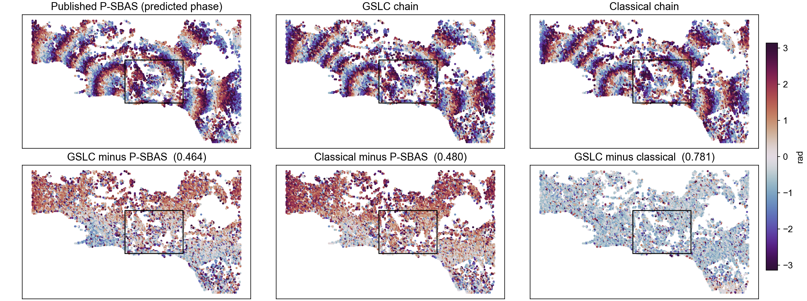
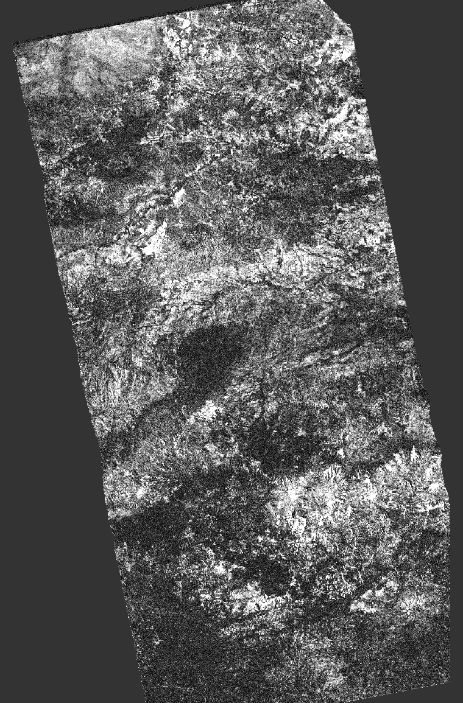

# GSLC Terrain Correction — User Tutorial

**Geocoded, phase-preserving InSAR of the 2026 Venezuela earthquake, in SNAP Desktop and from the command line.**

*This is a hands-on tutorial built on a real Sentinel-1 pair. For the algorithm and the design rationale, read the companion `GSLC-Geocoding-Explained.md`.*

---

## Scenario

On **24 June 2026** an earthquake **doublet** struck northern Venezuela: **Mw 7.2 at 18:04:33 local** (22:04:33 UTC), followed just **39 seconds later** by the **Mw 7.5 mainshock at 18:05:11 local** (22:05:11 UTC), on the right-lateral **San Sebastián fault**. To map the coseismic deformation with the **GSLC** (Geocoded SLC) approach we need an interferometric **pair** — one acquisition before the event and one after:

| Role | Satellite | Acquisition (local / UTC) | Timing vs mainshock |
|------|-----------|---------------------------|---------------------|
| **Reference** (pre-event) | Sentinel-1A | **23 Jun 2026, 18:50:50 / 22:50:50** | ~23.2 h before |
| **Secondary** (post-event) | Sentinel-1C | **24 Jun 2026, 18:49:58 / 22:49:58** | **~45 min after** |

> **Two products, not three.** GSLC InSAR is ordinary *pairwise* interferometry: one reference + one secondary = one interferogram, so **two products** are enough. (This is the key difference from the Phase Linking tutorial, whose distributed-scatterer covariance needs **≥ 3** epochs.) The pair is chosen for the event timing, and the timing here is exceptional: S1C acquired the same track (**relative orbit 106** — shared by S1A, S1C and S1D) just **44 minutes 47 seconds after the mainshock**. S1A the evening before + S1C 45 minutes after therefore bracket the event about as tightly as Sentinel-1 permits: an almost purely **coseismic** pair with a **1-day temporal baseline**, which keeps coherence high even over the tropical vegetation of the epicentral region, and which captures the displacement field before any appreciable afterslip has accumulated. (The 30 Jun *S1D* acquisition makes a good optional **post-seismic** pair against S1C — see the note at the end.)

Download the two products (free, by name) from the **Copernicus Data Space Ecosystem** (<https://dataspace.copernicus.eu>) or **ASF Vertex** (<https://search.asf.alaska.edu>) into a working folder. We process polarisation **VV**, subswath **IW3**. The full product names:

```text
S1A_IW_SLC__1SDV_20260623T225050_20260623T225120_065103_0834C8_BAD5.SAFE
S1C_IW_SLC__1SDV_20260624T224958_20260624T225025_008254_010515_304A.SAFE
```

The pair brackets the earthquake by about a day before and 45 minutes after, so the interferometric phase carries essentially pure coseismic ground displacement, with only the first ~45 minutes of afterslip included. Much of the affected terrain is rural; GSLC's phase-preserving geocoding puts both scenes on a common map grid so the deformation fringes can be formed and interpreted directly.

> **Where the scene sits relative to the rupture.** Read from the interferogram's own geocoding, the scene spans **lon −69.206 … −68.156, lat 9.619 … 11.443** (≈ 115 km E–W × 202 km N–S). The doublet's epicentre (**10.435° N, 68.472° W**) therefore falls **inside** the scene — about 34 km from the eastern edge and 80 km from the western one — so the epicentral zone is imaged directly. The rupture extends ~200 km along the San Sebastián fault, so it does run out of the scene to the east; the eastern part of the fault is not covered. Published finite-fault models (USGS, INGV, Peking University) put maximum slip at 3.6–4.5 m.

## What you will do

1. Generate the **reference GSLC** from S1A (IW3 / VV) — a phase-preserving, geocoded complex image, optionally **ETAD-corrected** first.
2. Feed the **raw secondary** (S1C) together with the reference GSLC to **`CreateStack`**, which auto-coregisters it onto the reference grid.
3. Form the **interferogram** (removing flat-earth **and** topographic phase) and filter it.
4. **Unwrap** with SNAPHU and convert to a coseismic displacement map — already geocoded, so no terrain correction is needed afterwards.

You will do it in the **SNAP Desktop** GUI and with **`gpt`** on the command line.

## Why use it

Traditional terrain correction geocodes amplitude and discards phase, so the classical InSAR chain stays in slant range through a long pipeline (Back-Geocoding → ESD → Interferogram → Deburst → Merge → Terrain-Correction) and geocodes last. **GSLC geocodes up front, preserving phase**, so each acquisition becomes a phase-preserving complex product on a **common map grid**. It is the "geocode-first" architecture behind global-scale InSAR systems (NISAR GSLC, OPERA CSLC-S1).

What that buys you in practice:

| | Classical chain | GSLC chain |
|---|---|---|
| **Steps to a geocoded interferogram** | Back-Geocoding → ESD → Interferogram → Deburst → Merge → Terrain-Correction | GSLC → CreateStack → Interferogram — already on the map |
| **Unit of processing** | the *pair*: every new pair re-runs coregistration in radar geometry | the *acquisition*: each scene is geocoded once, independently and in parallel, and reused in every pair it joins |
| **Adding a new date to a stack** | re-coregister against the reference | geocode the new scene onto the same standard grid — existing products are untouched |
| **Combining overlapping scenes** | tied to one radar geometry | every product with the same grid step is snapped to the same global lattice, so overlapping scenes line up on whole pixels |
| **Wrapped phase resampled after filtering?** | yes, by the final Terrain-Correction | never — the interferogram is born on the map grid |
| **Downstream use** | radar-geometry rasters need geocoding before GIS/ML | a GIS-ready complex raster, directly usable for time series, change detection and ML |

**It gives the same answer as the classical chain.** Measured on three sites against a classical control processed from the same SLCs (see *How does it compare to the traditional chain?*): wrapped-phase agreement **0.92** raw and **0.96** after removing one fitted plane on Sentinel-1 TOPS (Venezuela); on Sentinel-1 stripmap (Napa) the two independently unwrapped displacement maps agree to a **median of 0.05 cm**. At Campi Flegrei both chains were also scored against a **published** P-SBAS time series: they match it comparably (identical over 72 days; classical slightly closer over one year) and are level at fine scale.

## Prerequisites

- **SNAP 14+** with the SNAP Microwave Toolbox. Confirm the operator:
  ```
  gpt GSLC-Terrain-Correction -h
  ```
- The two Sentinel-1 SLC products above, downloaded to a working folder. SNAP reads either the unzipped `.SAFE` folder or the `.zip` directly.
- **Sentinel-1 IW** input must be a **single subswath from `TOPSAR-Split`** (burst-level). **Debursted** TOPS is **rejected**; **GRD** has no phase and is not usable. (Stripmap SLC — e.g. S-1 SM, ENVISAT ASAR IMS — is a direct input after `Apply-Orbit-File`.)
- Internet access for auto-downloaded precise orbits and the **Copernicus 30 m DEM**.

---

## Part A — SNAP Desktop (GUI)

### A1. Generate the reference GSLC (S1A, IW3 / VV)

1. **Prepare the input.** *File ▸ Open Product…* the S1A `.SAFE`, then **Radar ▸ Apply Orbit File**, then **Radar ▸ Sentinel-1 TOPS ▸ S-1 TOPS Split** and select **IW3** + **VV**.
2. **(Optional but recommended) Apply ETAD.** Menu **Radar ▸ Sentinel-1 TOPS ▸ S-1 ETAD Correction**, with the split product as source. See *A1b* below — do this **before** geocoding.
3. **Launch GSLC.** Menu **Radar ▸ Geometric ▸ Terrain Correction ▸ Geocoded SLC Terrain Correction** (dialog title *"GSLC Terrain Correction"*).
4. **I/O Parameters tab.** Source = the orbit-applied, split (and optionally ETAD-corrected) S1A product; target name gets suffix `_GSLC`; keep `BEAM-DIMAP`.
5. **Processing Parameters tab.** The fields that matter:

   | Field | Default | Notes |
   |-------|---------|-------|
   | Digital Elevation Model | Copernicus 30m Global | Auto-download; or point *External DEM* at a local file |
   | Image Resampling Method | BiSinc 5-point | **Keep a sinc kernel for InSAR** phase fidelity |
   | Grid Spacing | NATIVE_ANISOTROPIC | How the grid step is chosen when Pixel Spacing is 0. **NATIVE_ANISOTROPIC** (default): rectangular cells at the native sampling step of each axis (S1 IW: slant-range step east, ~14 m azimuth step north). **SQUARE_COARSEST**: square cells at the coarser axis (~14 m for S1 IW) — smallest output, discards ~4× of range detail. **SQUARE_FINEST**: square at the finer axis, ~16× the pixels of SQUARE_COARSEST. **Use the same setting for every product in a stack** — each choice is a different lattice. For a north step finer than native azimuth (see the next row), set the pixel spacings explicitly |
   | Pixel Spacing (m / deg) | 0 (auto) | Set explicitly to lock resolution across the pair; becomes the **east** step when a north spacing is also set |
   | Pixel Spacing North (m / deg) | 0 (square) | Optional **rectangular cells** to preserve the SLC's anisotropic native resolution (S1 IW ≈ 3.4 m ground range × 14 m azimuth → set ≈ 3.4 m east × 7.5 m north; the north step must be finer than native azimuth because the orbit heading rotates the radar axes from the map axes). Leave 0 for square cells |
   | Map Projection | WGS84(DD) | Any WKT CRS; use UTM for a metric grid |
   | Output phase-flattened complex data | **false** | **Leave false for InSAR.** True only for amplitude/PolSAR single-date use |
   | Restore TOPS azimuth carrier | **false** | **Leave false.** The carrier is acquisition-specific and does not cancel between acquisitions — restoring it corrupts cross-acquisition InSAR (~tens of spurious fringes per burst) |
   | Output separable phase terms | ✔ **on** (default) | Writes the removed deramp model as an `azimuthCarrierPhase` band (and the flattening phase). The Interferogram step then subtracts the two acquisitions' models **exactly** (their difference is the main reason a raw cross-acquisition GSLC interferogram shows extra fringes). The two phase bands are 64-bit, so they add about twice the size of the i/q data (~3× the product in total) — turn off only for pure backscatter work |
   | Apply Solid Earth Tide / Tropospheric | off | Turn on for displacement-grade (sub-decimetre) InSAR |

6. **Run.** The `S1A…_GSLC` product is a phase-preserving complex image on the map grid.

### A1b. ETAD correction (optional, recommended for displacement work)

**ETAD** supplies per-pixel range and azimuth timing corrections — tropospheric and ionospheric path
delay, solid-Earth geodetic effects, bistatic and FM-mismatch azimuth shifts. It moves geolocation by
centimetres to decimetres, which is small in amplitude terms but not in phase terms: one C-band range
fringe is 2.77 cm.

Open **Radar ▸ Sentinel-1 TOPS ▸ S-1 ETAD Correction** with the **split** product as source (before
GSLC — the corrections are defined in radar timing and must be applied in radar geometry).

| Field | Setting | Notes |
|-------|---------|-------|
| ETAD product | *(leave empty)* | Found and downloaded automatically (the search picks the candidate with **maximum time overlap**, so an adjacent slice of the same datatake is no longer selected by mistake). Requires **Copernicus Data Space credentials** stored in SNAP — see the note below. Browse to a local `S1*_ETA_*.SAFE` to override — it must be the **same mission, date and slice** as the input |
| Resampling Type | BiSinc 5-point | Match the kernel used for GSLC |
| Resampling Image | ✔ **on — required for GSLC** | Off switches to the classical InSAR mode: the corrections are only *attached* as grids that the classical slant-range chain consumes downstream. **A GSLC chain can never read those grids, so "off" is a silent no-op for this tutorial** (measured: bit-identical output) |
| **Output Phase Corrections** | ✔ **ON for InSAR** (default off) | **Essential.** See the note below — without it the atmospheric delay stays in the phase |
| Sum Of Range Corrections | ✔ **on** (default) | The **total** range correction — tropospheric and ionospheric delay included |
| Sum Of Azimuth Corrections | ✔ **on** (default) | The total azimuth correction |
| Individual layers (Tropospheric / Ionospheric / Geodetic / Doppler / Bistatic / FM Mismatch) | all **off** (default) | Only for isolating one contribution when studying it |

> **Tick *Output Phase Corrections* — resampling alone does not correct InSAR phase.** An atmospheric
> delay Δr does two things: it makes the target *appear* at range R + Δr, and it adds −4πΔr/λ to the
> phase the pixel carries. Resampling the image moves the pixel back to R but leaves that phase
> untouched, so the differential term survives into the interferogram in full. With *Output Phase
> Corrections* on, the range-delay phase is removed from the complex samples themselves, which is what
> you want for a geocoded chain — the correction is then baked in before geocoding and carried through
> automatically.
>
> This matters specifically for GSLC: `InterferogramOp`'s ETAD handling runs only on the classical
> (slant-range) paths, so a geocoded stack cannot subtract ETAD grids downstream. The correction has to
> be applied to the complex data up front.

> **The defaults are not "no corrections".** The two *Sum Of…* boxes are ticked by default and already
> contain the total correction. The seven individual checkboxes are unticked, which does **not** mean
> nothing is applied — they select a *subset*, and you would tick one only after unticking the sums.

> **Credentials for auto-download.** The search authenticates against the Copernicus Data Space. Set
> them once under **Tools ▸ Options ▸ General ▸ Credentials** (the same ones the Product Library uses).
> Without them the operator reports `ETAD product not found` even when a product exists.

> **Keep the original product name.** ETAD matches the SAR product to the ETAD product using the
> sensing start/stop timestamps *in the product name*. Renaming an intermediate to something short
> (`my_subset`) breaks the match; appending a suffix is fine —
> `S1A_IW_SLC__1SDV_20260623T225050_…_split` works.
>
> **"The selected ETAD product does not match the source product."** The message prints both sensing
> windows — read them. The usual cause is the **adjacent slice** of the same datatake (same mission,
> same date, same orbit, but a window ~25 s off that only overlaps your scene by a couple of seconds)
> or a cross-date/cross-mission pick. Select the ETAD file whose window *contains* your scene's.

> **Apply to both acquisitions, or to neither.** A stack mixing an ETAD-corrected reference with an
> uncorrected secondary puts the differential timing correction straight into the interferometric phase.
> Since `CreateStack` rebuilds a raw secondary from the reference's settings, the clean way to use ETAD
> is to correct and geocode **both** legs yourself, then stack two GSLCs.

> **Do not combine with GSLC's own tropospheric option.** ETAD's tropospheric layer and GSLC's
> `Apply Tropospheric Correction` model the same delay — enabling both double-counts it. ETAD is the
> measured estimate and is preferred where a product exists; the same applies to ETAD's geodetic layers
> versus *Apply Solid Earth Tide*.

### A2. Build the coseismic interferogram (reference GSLC + raw secondary)

You only geocode the **reference** explicitly; `CreateStack` auto-coregisters the raw secondary.

1. **Prepare the secondary.** Apply-Orbit-File + TOPSAR-Split (**IW3**, **VV**) to **S1C**, but **do not** run GSLC on it.
2. **Create Stack** — *Radar ▸ Coregistration ▸ Stack Tools ▸ Create Stack*: add the **reference GSLC** (S1A) and the **raw split secondary** (S1C). CreateStack reads the reference's `gslc_source_slc_path` stamp, cross-correlates against the secondary to estimate the (Δrange, Δazimuth) bias, rebuilds the secondary GSLC with that bias, and stacks the two on the reference grid.
3. **Interferogram Formation** — *Radar ▸ Interferometric ▸ Products ▸ Interferogram Formation*. In *Processing Parameters*:
   - Keep **Subtract flat-earth phase** ticked.
   - **✔ Tick "Subtract topographic phase".** This simulates the topographic fringes from the DEM and removes them, so the interferogram shows **deformation + residual atmosphere** rather than topography — essential for reading the coseismic signal.
   - **There is no "Subtract Residual Ramp" checkbox any more.** Earlier drafts of this tutorial told you to tick it, because cross-acquisition GSLC interferograms showed a large smooth per-burst residual. That residual was a **bug**, not the annotations: the carrier-difference add-back had the wrong sign, leaving `2 × (m_ref − m_sec)` in every GSLC TOPS interferogram. With the sign corrected, the same Venezuela pair agrees with the classical chain at a phase concentration of **0.96**, against **0.33** with the ramp estimator enabled — it was removing real signal. The data-driven ramp family has been removed (`docs/gslc-parity/etna-ramp-ab.md`). What runs automatically, and is what was doing the work all along: when both GSLCs carry the `azimuthCarrierPhase` band (*Output separable phase terms* in A1, on by default), the operator subtracts the two deramp models' **exact difference**. Watch the log for `GSLC carrier-difference: exact deramp-model subtraction active` — that is the line you want to see.
   - Keep **Include coherence** ticked, and set **Coherence Window (m)** to **100**. A window in metres is square on the ground in both geometries, so GSLC and radar-geometry coherence are directly comparable; a window in pixels means something different on a map grid than on an SLC.
4. **Goldstein Phase Filtering** → **SnaphuExport → SNAPHU → SnaphuImport** (unwrap) → **Phase to Displacement** (line-of-sight displacement in metres).

   Because the GSLC pair is **already geocoded**, the displacement map is already in map coordinates — **no final Range-Doppler Terrain Correction is needed** (one fewer step than the traditional chain).

> **Consistency rule:** reference and secondary must share the **same** `Output phase-flattened` setting, the same `Restore TOPS azimuth carrier` setting (leave it off — restoring the carrier corrupts cross-acquisition interferograms with tens of spurious fringes per burst), **and the same `Output separable phase terms` setting** (the exact model subtraction needs the band on *both* legs; with only one it logs a warning and falls back to the data-driven fit alone). Mixing the first two conventions yields a meaningless (noise) interferogram. The CreateStack auto-coregister path enforces all three from the reference's metadata stamps and bands.

---

## Part B — Command line (`gpt`)

Run these from your working folder; the graphs take the input products as parameters, so no paths are hard-coded.

### Step 1 — generate the reference GSLC (S1A)

Save as `gslc_reference.xml`:

```xml
<graph id="GSLC-Reference">
  <version>1.0</version>
  <node id="Read"><operator>Read</operator><sources/>
    <parameters><file>${s1a}</file></parameters>
  </node>
  <node id="Apply-Orbit-File"><operator>Apply-Orbit-File</operator>
    <sources><sourceProduct refid="Read"/></sources>
    <parameters><orbitType>Sentinel Precise (Auto Download)</orbitType><continueOnFail>false</continueOnFail></parameters>
  </node>
  <node id="TOPSAR-Split"><operator>TOPSAR-Split</operator>
    <sources><sourceProduct refid="Apply-Orbit-File"/></sources>
    <parameters><subswath>IW3</subswath><selectedPolarisations>VV</selectedPolarisations></parameters>
  </node>
  <node id="GSLC-Terrain-Correction"><operator>GSLC-Terrain-Correction</operator>
    <sources><sourceProduct refid="TOPSAR-Split"/></sources>
    <parameters>
      <demName>Copernicus 30m Global DEM</demName>
      <imgResamplingMethod>BISINC_5_POINT_INTERPOLATION</imgResamplingMethod>
      <pixelSpacingInMeter>0</pixelSpacingInMeter>
      <mapProjection>WGS84(DD)</mapProjection>
      <outputFlattened>false</outputFlattened>
      <!-- writes the removed deramp model as a band; Interferogram then subtracts the two
           acquisitions' models exactly. Default true; shown for clarity -->
      <outputPhaseTerms>true</outputPhaseTerms>
      <applySolidEarthTide>false</applySolidEarthTide>
      <applyTroposphericCorrection>false</applyTroposphericCorrection>
    </parameters>
  </node>
  <node id="Write"><operator>Write</operator>
    <sources><sourceProduct refid="GSLC-Terrain-Correction"/></sources>
    <parameters><file>${output}</file><formatName>BEAM-DIMAP</formatName></parameters>
  </node>
</graph>
```

```
gpt gslc_reference.xml ^
    -Ps1a=S1A_IW_SLC__1SDV_20260623T225050_20260623T225120_065103_0834C8_BAD5.SAFE ^
    -Poutput=S1A_GSLC.dim -c 12G -q 8
```

For **displacement-grade** work, add `-PapplySolidEarthTide=true -PapplyTroposphericCorrection=true` (and use the **same** setting for the secondary, which CreateStack rebuilds from the reference's stamp).

#### Step 1b (optional but recommended) — ETAD correction

**ETAD** (Extended Timing Annotation Dataset) is an auxiliary Sentinel-1 product that supplies per-pixel
range and azimuth timing corrections — tropospheric and ionospheric path delay, solid-Earth geodetic
effects, bistatic and FM-mismatch azimuth shifts. Applying it moves geolocation by **centimetres to
decimetres**, which is small in amplitude terms but *not* small in phase terms: at C-band one range
fringe is only 2.77 cm of line-of-sight.

ETAD belongs **on the split SLC, before geocoding** — the corrections are defined in radar timing, so
they must be applied while the product is still in radar geometry:

```
Read → Apply-Orbit-File → TOPSAR-Split → S1-ETAD-Correction → GSLC-Terrain-Correction
```

Insert this node between `TOPSAR-Split` and `GSLC-Terrain-Correction` in `gslc_reference.xml`:

```xml
  <node id="S1-ETAD-Correction"><operator>S1-ETAD-Correction</operator>
    <sources><sourceProduct refid="TOPSAR-Split"/></sources>
    <parameters>
      <resamplingType>BISINC_5_POINT_INTERPOLATION</resamplingType>
      <resamplingImage>true</resamplingImage>
      <!-- essential for InSAR: removes the range-delay phase from the complex data.
           Without it, resampling fixes geolocation but leaves the atmospheric phase in place. -->
      <outputPhaseCorrections>true</outputPhaseCorrections>
      <sumOfRangeCorrections>true</sumOfRangeCorrections>
      <sumOfAzimuthCorrections>true</sumOfAzimuthCorrections>
    </parameters>
  </node>
```

then point `GSLC-Terrain-Correction`'s source at `S1-ETAD-Correction`. That is the whole change — the
command line is unchanged:

```
gpt gslc_reference.xml -Ps1a=…SAFE -Poutput=S1A_GSLC.dim -c 12G -q 8
```

> **The ETAD product is found and downloaded automatically.** Leave `etadFile` unset and the operator
> searches the Copernicus Data Space for the ETAD product matching the acquisition and downloads it to
> SNAP's cache (`<cache>/etad`). This requires **Copernicus Data Space credentials stored in SNAP**
> (*Tools → Manage External Tools / Product Library credentials* — the same ones used for product
> download); without them the search cannot authenticate. If a product is genuinely unavailable the
> operator fails with `ETAD product not found`. You can still pass `etadFile` explicitly to use a local
> product.

> **What the defaults actually do.** `sumOfRangeCorrections` and `sumOfAzimuthCorrections` default to
> **`true`**, while every individual layer (`troposphericCorrectionRg`, `ionosphericCorrectionRg`,
> `geodeticCorrectionRg`, `dopplerShiftCorrectionRg`, `geodeticCorrectionAz`,
> `bistaticShiftCorrectionAz`, `fmMismatchCorrectionAz`) defaults to **`false`**. That is *not* "no
> corrections applied" — the summed layers already contain the total range and azimuth correction,
> tropospheric and ionospheric delay included. The individual switches exist to apply a **subset**,
> which is what you want only when isolating one contribution for study.

> **Apply ETAD to both acquisitions, or to neither.** A stack mixing an ETAD-corrected reference with an
> uncorrected secondary puts the differential timing correction straight into the interferometric phase.
> When `CreateStack` auto-geocodes a raw secondary it rebuilds it from the reference's stamps, so if you
> ETAD-correct the reference you should ETAD-correct the secondary and geocode it yourself, then stack
> two GSLCs (see the all-GSLC note in *Next steps*).

> **Do not use ETAD together with GSLC's own `applyTroposphericCorrection`.** Both model the same
> tropospheric path delay, so enabling both double-counts it. Choose one: ETAD (measured, from the
> auxiliary product) or GSLC's Saastamoinen model (computed). ETAD is the better estimate where an ETAD
> product exists. `applySolidEarthTide` overlaps with ETAD's geodetic layers in the same way.

### Step 2 — GSLC interferogram, end to end

`reference GSLC + raw secondary (S1C) → CreateStack (auto-coregister) → Interferogram (flat-earth + topo removed) → Goldstein → Write`. Save as `gslc_insar.xml`:

```xml
<graph id="GSLC-InSAR">
  <version>1.0</version>
  <node id="ReadReference"><operator>Read</operator><sources/>
    <parameters><file>${reference_gslc}</file></parameters>
  </node>

  <!-- raw secondary: orbit + split only (NOT geocoded); CreateStack geocodes it -->
  <node id="ReadSecondary"><operator>Read</operator><sources/>
    <parameters><file>${secondary}</file></parameters>
  </node>
  <node id="OrbitSecondary"><operator>Apply-Orbit-File</operator>
    <sources><sourceProduct refid="ReadSecondary"/></sources>
    <parameters><orbitType>Sentinel Precise (Auto Download)</orbitType><continueOnFail>false</continueOnFail></parameters>
  </node>
  <node id="SplitSecondary"><operator>TOPSAR-Split</operator>
    <sources><sourceProduct refid="OrbitSecondary"/></sources>
    <parameters><subswath>IW3</subswath><selectedPolarisations>VV</selectedPolarisations></parameters>
  </node>

  <node id="CreateStack"><operator>CreateStack</operator>
    <sources>
      <sourceProduct refid="ReadReference"/>
      <sourceProduct.1 refid="SplitSecondary"/>
    </sources>
    <parameters><resamplingType>NONE</resamplingType></parameters>
  </node>
  <node id="Interferogram"><operator>Interferogram</operator>
    <sources><sourceProduct refid="CreateStack"/></sources>
    <parameters>
      <subtractFlatEarthPhase>true</subtractFlatEarthPhase>
      <subtractTopographicPhase>true</subtractTopographicPhase>
      <demName>Copernicus 30m Global DEM</demName>
      <includeCoherence>true</includeCoherence>
      <cohWinSizeMeters>100</cohWinSizeMeters>
    </parameters>
  </node>
  <node id="GoldsteinPhaseFiltering"><operator>GoldsteinPhaseFiltering</operator>
    <sources><sourceProduct refid="Interferogram"/></sources>
    <parameters/>
  </node>
  <node id="Write"><operator>Write</operator>
    <sources><sourceProduct refid="GoldsteinPhaseFiltering"/></sources>
    <parameters><file>${output}</file><formatName>BEAM-DIMAP</formatName></parameters>
  </node>
</graph>
```

```
gpt gslc_insar.xml ^
    -Preference_gslc=S1A_GSLC.dim ^
    -Psecondary=S1C_IW_SLC__1SDV_20260624T224958_20260624T225025_008254_010515_304A.SAFE ^
    -Poutput=ifg_GSLC.dim -c 12G -q 8
```

The **`subtractTopographicPhase`** flag is the command-line equivalent of the *Subtract topographic phase* checkbox — it removes the DEM-simulated topographic fringes so the coseismic deformation signal remains. The exact deramp-model subtraction needs no flag: it activates whenever both GSLCs carry the `azimuthCarrierPhase` band (`outputPhaseTerms=true` in Step 1; look for `GSLC carrier-difference: exact deramp-model subtraction active` in the log). **`subtractResidualRamp` no longer exists** — see Step 2 and `docs/gslc-parity/etna-ramp-ab.md`.

### Step 3 — Unwrap to displacement (SNAPHU)

The interferogram phase is *wrapped* into (−π, π]. Converting it to displacement needs **unwrapping**,
done by the external **SNAPHU** program via export → run → import. Because a GSLC interferogram is
already geocoded, the unwrapped result is a displacement map in map coordinates with no further
terrain correction.

**1. Get the SNAPHU binary.** `Radar → Interferometric → Unwrapping → Batch Snaphu Unwrapping`
downloads it for you; the direct URLs are **Windows 64-bit: v2.0.4**
(`step.esa.int/thirdparties/snaphu/2.0.4/snaphu-v2.0.4_win64.zip`), Windows 32-bit and Linux/macOS:
v1.4.2 (`.../snaphu/1.4.2-2/…`). Keep the extracted `bin/` directory intact — on Windows `snaphu.exe`
needs the `msys-2.0.dll` shipped beside it.

**2. Export.**

```
gpt SnaphuExport -Ssource=ifg_GSLC.dim -PtargetFolder=snaphu_out ^
    -PstatCostMode=DEFO -PinitMethod=MST ^
    -PnumberOfTileRows=6 -PnumberOfTileCols=4 -PnumberOfProcessors=8 ^
    -ProwOverlap=400 -PcolOverlap=400 -PtileCostThreshold=500
```

> **`SnaphuExport` needs a band whose unit is `phase`** — not i/q. It ignores the complex bands and
> looks for a phase band plus a coherence band, so a product carrying only `i_`, `q_` and `coh_` fails
> with `Wrapped phase band required`. The interferogram written by Step 2 has the virtual
> `Phase_ifg_…` band and works as-is; the trap appears if you `Subset` first and select only the
> complex bands. Include the `Phase_…` band in the subset (its `atan2(q,i)` expression needs `i_`/`q_`
> present too).

**3. Run SNAPHU** from the created folder, using the command SNAP writes into line 7 of `snaphu.conf`
(the last argument is the raster **width**):

```
cd snaphu_out/ifg_GSLC
snaphu -f snaphu.conf Phase_ifg_IW3_VV_23Jun2026_24Jun2026.snaphu.img 4000
```

**4. Import** the result, then convert to displacement:

```
gpt SnaphuImport -SsnaphuPhase=snaphu_out/ifg_GSLC/UnwPhase_….snaphu.hdr ^
    -Swrapped=ifg_GSLC.dim -t unw_GSLC.dim
gpt PhaseToDisplacement -Ssource=unw_GSLC.dim -t disp_GSLC.dim
```

#### Practical limits worth knowing before you start

- **Multilook before unwrapping — it helps, substantially.** At single-look the interferogram is
  noise-dominated (median coherence 0.23 on this pair), and unwrapping low-coherence data is where
  SNAPHU goes wrong. Multilooking to roughly **8 × 8 (≈110 m cells)** on this scene raised the
  coherence estimate from **0.23 to 0.67**, made the field small enough to unwrap in **a single tile**,
  and cut runtime from 19 minutes to 64 seconds. Verify the choice for your own scene by multilooking
  at several factors and measuring the block-to-block phase step: it *falls* while noise dominates and
  starts to *rise* once cells get large enough to smear real signal — take the minimum. Going too far
  (32 × 32 here) does begin to under-sample the deformation.
- **Tile overlap, or better, no tiles.** SNAPHU warns `Tile overlap is small (may give bad results)`
  when overlap is marginal relative to tile size — 200 px on 1000 px tiles triggers it. On this pair a
  24-tile full-resolution unwrap produced a displacement field that disagreed with three independent
  multilooked solutions by ~18 cm over 93% of pixels; the multilooked solutions agreed with each other
  to 0.8–1.8 cm. **Multilooking enough to avoid tiling altogether is the more reliable route.** If you
  must tile, use generous overlap (≥400 px) and always re-run with a different tiling to confirm the
  field does not change.
- **Coherence sets the ceiling.** Unwrapping is a guess where coherence is low, and it fails *silently* —
  the output is always a smooth-looking raster. On this pair the median coherence over the epicentral
  subset is only ≈0.23, with 14% nodata.
- **A GSLC-specific caveat.** `snaphu.conf` is populated with **radar-geometry** parameters
  (`DR` = slant-range spacing ≈2.33 m, `DA` = azimuth ≈15.6 m, and `NCORRLOOKS` derived from them),
  but a GSLC raster is in **map** geometry (13.89 m square for this pair with `gridSpacing=SQUARE_COARSEST`; rectangular with the default `NATIVE_ANISOTROPIC`). `DEFO` costs are generic enough to
  remain usable, but SNAPHU's statistical cost model is being given spacings that do not describe the
  grid it is working on. Treat the unwrapped amplitude as approximate until validated.

#### Check the unwrapped result rather than trusting it

An unwrapped raster always looks plausible. Four cheap tests:

1. **Re-wrap:** `wrap(unwrapped)` must reproduce the input wrapped phase wherever coherence is decent.
   This catches scaling, offset and byte-order errors in one shot. (Note the exported `.snaphu.img`
   files are **native/little-endian** float32, whereas BEAM-DIMAP `.img` files are big-endian.)
2. **Residue density** in the *wrapped* input — bounds how much of the field could be unwrapped
   unambiguously at all, independent of what SNAPHU returned.
3. **2π jumps** between adjacent pixels in high-coherence areas: these are unwrapping errors, not signal.
4. **Stratify by coherence:** report displacement statistics per coherence bin. If the "signal" exists
   only in the low-coherence bins, it is noise.

For the full worked example with figures, see the notebook **`snap-nb-sar-gslc-insar`**.

## How does it compare to the traditional chain?

The fair question is not "which picture looks nicer" but "do the two chains deliver the **same
phase and the same coherence** from the same pair". Answering that needs a like-for-like
comparison, and the rules for one are easy to break:

> **Comparing like with like.**
> - **Same filtering on both sides** — both unfiltered, or both through the same filter. A
>   Goldstein-filtered interferogram against an unfiltered one differs by the filter, not by the
>   chain: on Napa, filtered classical against unfiltered GSLC scores 0.639, while both unfiltered
>   score 0.785 and both filtered 0.892.
> - **Same coherence window in metres** (`cohWinSizeMeters`), not in pixels — a 10 × 10 window
>   covers a different patch of ground on an SLC than on a map grid.
> - **Compare complex values, never wrapped phase.** Resample `i`/`q` (or bin them), then take the
>   angle of `GSLC · conj(classical)`. Interpolating a wrapped phase raster manufactures errors at
>   every ±π cut.
> - **Score with phase concentration** `|mean(exp(jΔφ))|`: 1 means identical phase, 0 means
>   unrelated. It ignores a constant offset and is robust to wrapping.

Measured that way on three sites, from the same SLCs and the same DEM (Copernicus 30 m):

| Site | Mode | Phase agreement GSLC vs classical | Samples |
|------|------|-----------------------------------|---------|
| **Venezuela** (S1A × S1C, 1 day) | IW TOPS | **0.921** raw, **0.961** with one fitted plane removed | 354 543 radar cells, nothing resampled |
| **Napa** (S1A, 7 × 31 Aug 2014) | Stripmap | **0.785**, both single look and unfiltered | 2.14 M map samples |
| **Napa**, filtered | Stripmap | **0.892**, both Goldstein-filtered | 2.14 M map samples |
| **Napa**, unwrapped | Stripmap | median \|Δ\| **0.05 cm** line-of-sight, correlation 0.905 | 400 949 map samples |
| **Campi Flegrei**, 72 d (S1A, 9 Aug × 20 Oct 2023) | IW TOPS | **0.840** at 37 m (0.694 single look) | 48 593 P-SBAS points |
| **Campi Flegrei**, 1 yr (S1A, 13 Oct 2022 × 20 Oct 2023) | IW TOPS | **0.789** at 37 m (0.578 single look) | 48 591 P-SBAS points |

**Coherence**, both chains with a 100 m ground window (`cohWinSizeMeters`), on the same shared samples
as the phase comparison (radar cells at Venezuela, map samples elsewhere):

| Site | Classical / GSLC mean coherence | Difference, mean / median |
|------|---------------------------------|---------------------------|
| Venezuela | 0.280 / 0.285 | +0.006 / +0.003 |
| Napa | 0.416 / 0.418 | +0.002 / −0.001 |
| Campi Flegrei, 72 d | 0.238 / 0.245 | +0.007 / +0.006 |
| Campi Flegrei, 1 yr | 0.227 / 0.232 | +0.005 / −0.000 |

The chains agree on coherence to within ~3 %, with medians differing by under 0.01. The slightly
higher GSLC means are consistent with its finer, oversampled map grid (neighbouring GSLC pixels are
not fully independent looks), so they are not a quality claim.

> **A metadata fix these numbers depend on.** Before 26 Sep 2026 the GSLC product recorded its
> east–west pixel spacing converted at the equator instead of at the scene's latitude. A metre-based
> coherence window was therefore too small east–west at mid latitudes: ~79 m instead of 100 m at
> Napa, ~76 m at Campi Flegrei (negligible at Venezuela's 10° N). A smaller window biases coherence
> upwards, and it had roughly doubled the apparent GSLC lead at Campi Flegrei (ratio 1.06 → 1.03 after
> the fix). The Napa and Campi Flegrei values above are re-measured with the fix. If you rely on
> `cohWinSizeMeters` with GSLC products made before that date, re-run `GSLC-Terrain-Correction`.

### Venezuela — Sentinel-1 IW TOPS


Here the GSLC records, for every map pixel, the source range/azimuth index it was read from, so both
chains can be binned into the same ~100 m radar cells **without resampling either one**. That is the
cleanest comparison possible: both unfiltered, it gives 0.961 after removing a single plane. The gap
to the raw 0.921 is a faint scene-scale gradient, the only systematic difference left between the
chains.

### Napa — Sentinel-1 stripmap


The real test of a deformation product is the displacement map. Each chain was multilooked to
~20 m, Goldstein-filtered and unwrapped **independently** with SNAPHU:


Median absolute difference **0.05 cm**. The RMS (1.04 cm) is not a chain difference: most of the 9 %
of samples that differ by more than 1 cm sit on whole fringes of λ/2 = 2.77 cm, the signature of
unwrapping choices, not of phase error.

### Campi Flegrei — small-scale volcanic uplift, against a published reference

Venezuela and Napa compare the two chains with each other. Campi Flegrei adds a **third party**: the
caldera west of Naples has been rising since 2005 (at the peak, about 1.4 cm per month of
line-of-sight motion over the year used here, per the P-SBAS series below), and CNR-IREA and INGV
published their Sentinel-1 **P-SBAS** displacement time series for it openly (Giudicepietro et al.
2024, *Int. J. Appl. Earth Obs. Geoinf.* 132:104060; data on Zenodo, doi:10.5281/zenodo.10781496,
CC-BY 4.0). Differencing two epochs of that series gives the published displacement for exactly our
pair, so each chain can be scored against it.


**Setup.** S1A descending track 22, IW1, the two bursts over the caldera (burst IDs 45938/45939),
split with a WKT area of interest so every date covers the same ground. Both chains use the same
auto-downloaded Copernicus 30 m DEM, with no filtering and no ETAD on either side. Each chain's
interferogram is averaged to the P-SBAS 37 m resolution and scored against the phase predicted from
the published displacement. No unwrapping is needed, and the unknown constant between the two
references cancels. The P-SBAS product is itself multilooked (2 × 10) and Goldstein-filtered, so the
absolute scores against it are floor-limited; they are for comparing the two chains with each other,
not with other sites.




| Campi Flegrei (48 593 / 48 591 P-SBAS points) | 72 days | 1 year |
|---|---|---|
| Published P-SBAS peak displacement | 5.2 cm | 17.7 cm |
| **GSLC vs classical** | **0.840** | **0.789** |
| GSLC vs published P-SBAS | 0.350 | 0.336 |
| Classical vs published P-SBAS | 0.349 | 0.358 |
| Fine scale (residual high-passed at 2 km), caldera centre: GSLC / classical | 0.595 / 0.591 | 0.548 / 0.556 |

Two things stand out:

- **Both chains match the published result comparably.** Over 72 days they are identical (0.350 vs
  0.349); over one year classical is slightly closer (0.358 vs 0.336). At fine scale — the residual
  high-passed at 2 km, averaged over 50 placements of the block grid — they are level on both pairs:
  the difference never exceeds ±0.03 in either direction. One pair each, so read these as one data
  point per interval, not a rule.
- **The residual against P-SBAS is most likely atmosphere, and both chains carry it equally.** It
  repeats in both pairs (block-scale agreement 0.73, against 0.30 for random), and the two pairs share
  only one date, 20 Oct 2023. The P-SBAS series departs from its own local trend by only ~0.26 cm
  per epoch, so it carries little per-date atmosphere, while a single interferogram keeps all of it.
  The ETAD tropospheric delay, an independent weather-model estimate, raises the agreement from 0.349
  to 0.382 (GSLC) and 0.378 (classical) with the physically expected sign, and trims the km-scale
  residual by ~12 % on average — equally for both chains. Most of the residual is left: consistent
  with small-scale atmosphere a weather model cannot resolve, but not proven.


> **What this means for your own processing.** A single GSLC pair measures deformation *plus* the
> atmospheric delay of its two dates, typically a few millimetres at km scale, as here. For
> centimetre-level uplift this is small; for millimetre-level signals, use ETAD (see A1b) and
> consider several pairs or a time series.

### What to take from it

- **Same phase.** On all three sites the GSLC chain reproduces the classical interferogram — while
  being shorter, per-acquisition and already geocoded.
- **Checked against a published result, not just against itself.** At Campi Flegrei both chains
  match an independent, published P-SBAS time series comparably, and are level at fine scale.
- **GSLC never resamples wrapped phase.** The interferogram is born on the map grid, filtered there,
  and is final. A classical displacement product should be unwrapped in radar geometry *before*
  terrain correction; GSLC sidesteps that ordering issue entirely. (Terrain-Correction now detects an
  InSAR source and geocodes the complex pair *as complex*, re-deriving Phase — so a default TC of an
  interferogram no longer interpolates wrapped phase.)
- **Phase-agreement numbers are not comparable across sites.** Venezuela is binned with nothing
  resampled; Napa resamples both sides onto one grid; Campi Flegrei is scored on P-SBAS points at
  37 m. Compare within a row, not across rows.

> **Variant — Sentinel-1 stripmap (the Napa pair above).** The same workflow runs on stripmap with
> one step fewer: there are no bursts, so **skip TOPSAR-Split** and go straight from
> `Apply-Orbit-File` to `GSLC-Terrain-Correction`. The pair used above is
> `S1A_S1_SLC__1SSV_20140807T142342_20140807T142411_001835_001BC1_05AA` (reference) and
> `S1A_S1_SLC__1SSV_20140831T142335_20140831T142403_002185_002356_C2E5` (secondary), VV, bracketing
> the M6.0 South Napa earthquake of 24 Aug 2014. A full stripmap frame is large (~53 000 lines); a
> `Subset` around the epicentre (38.215° N, 122.312° W), followed by `Apply-Orbit-File`, keeps the
> run to minutes — that is the order used for the results above. Leave the subset's *copy metadata*
> on — GSLC needs the orbit and geolocation grid.

> **Optional extension — post-seismic pair.** The 30 Jun **S1D** acquisition (same track, `S1D_IW_SLC__1SDV_20260630T225009_20260630T225040_003472_006226_2543.SAFE`) pairs with S1C (24 Jun) to image the **first six days of post-seismic motion**: repeat the same workflow with S1C as reference and S1D as secondary. Comparing the coseismic and post-seismic interferograms is a compact demonstration of why acquisition timing matters as much as processing.

---

## Reading / validating the output

- The `S1A_GSLC` product is a geocoded complex image (`i_/q_` bands) plus any diagnostic bands you enabled (DEM, lat/lon, incidence, layover-shadow, simulated phase).
- After `Interferogram`, inspect the **coherence** band and the **wrapped phase** (fringes). Over stable terrain coherence should be high and fringes smooth; the fringes that crowd toward the fault trace are the coseismic deformation. Sanity-check against a traditional-pipeline interferogram of the same S1A/S1C pair. Because this is a long right-lateral strike-slip rupture, expect **fault-parallel, elongated** fringe bands whose spacing tightens toward the fault (each fringe = 2.8 cm of line-of-sight displacement) — not concentric lobes about a point — with narrow decorrelated strips where the near-field gradient exceeds one fringe per pixel.



- **Judge the phase after filtering or multilooking, not at full resolution.** A single-look interferogram at realistic coherence (γ ≈ 0.2 over vegetation) looks like noise on screen even when it is perfectly correct — and a terrain-corrected comparison image has been implicitly smoothed by its resampling. Apply Goldstein filtering or a 4×4 multilook before deciding whether the interferogram "worked".
- **Write the stack to disk before running `Interferogram` on large scenes** (as the graphs in this tutorial do). Chaining Interferogram directly onto an in-memory CreateStack→GSLC graph recomputes geocoding tiles many times over and can appear to hang.

## Troubleshooting

| Symptom | Cause / fix |
|---------|-------------|
| Operator rejects a debursted TOPS product | GSLC needs a **split (burst-level)** TOPS product or a Stripmap SLC; debursted TOPS is explicitly rejected. **GRD** has no phase — it isn't blocked but yields a degenerate product, so don't use it. |
| Interferogram is pure noise | (1) `outputFlattened` mismatched between reference and secondary — must be identical; (2) large residual misregistration — use the CreateStack auto-coregister path. |
| Coherence lower than expected | Check DEM quality; for displacement scenes enable SET + troposphere; verify like-for-like comparison (same multilook, same area). Note S1A↔S1C is a cross-platform constellation pair — confirm they share the relative orbit/track (this pair: both on relative orbit 106). |
| Reference and secondary don't align | Ensure both use the same pixel spacing (GSLC always snaps to the shared standard grid automatically); let CreateStack set the sub-pixel `rangeOffsetPixels`/`azimuthOffsetPixels`. |
| Topographic fringes still dominate the interferogram | Enable **Subtract topographic phase** (`subtractTopographicPhase=true`) with a valid DEM. |
| Regular fringes / wavy "fringe packets" that the traditional interferogram doesn't show — possibly only over *part* of the scene | Before the carrier-sign fix this was the inverted add-back leaving `2 × (m_ref − m_sec)`, and the advice was to enable the (now removed) residual ramp. Now: check the log for `GSLC carrier-difference: exact deramp-model subtraction active`. If it is missing, one of the GSLCs was built with **Output separable phase terms** switched off (`outputPhaseTerms=false`) — rebuild it, rather than reaching for `subtractResidualRamp`. (A decimated screen zoom of a fine GSLC grid also aliases dense correct fringes into wavy packets; judge multilooked.) |
| A sharp phase-jump line near one edge of the scene, bounding a noisy band that fades toward far range | The two TOPSAR-Splits framed **different burst windows** (e.g. 10 vs 9 bursts): in the extra-burst region the legs used to pair *adjacent* bursts — disjoint Doppler bands, inherently incoherent. Fixed by the burst-boundary lock: the secondary now stays on the burst the reference frames and masks what cannot pair (log: `edge seam(s) pushed to the matched burst's extent`). Rebuild the stack with the CreateStack auto-coregister path; if stacking two prebuilt GSLCs by hand, pass the reference's `gslc_burst_valid_times` stamp as `refBurstValidTimes` on the secondary's GSLC step. |
| Elongated bands / subtle phase breaks along burst seams, strongest over part of the range swath, at several seams | A residual discontinuity at the burst seams, range-varying (so it can look strong at near range and invisible mid-swath). Tick **Subtract Burst Seam Steps (GSLC)** (`subtractSeamSteps=true`): the Interferogram step measures each seam's step directly and subtracts it (log: `GSLC seam steps (pair N): [s0 ... rad @near/mid/far]`). This is safe to use on its own — across-seam differencing cannot absorb deformation or atmosphere, which are continuous across seams — and it no longer requires `subtractResidualRamp`. Seams inside heavily decorrelated areas are left untouched (unmeasurable — and invisible there anyway). |
| ETAD: `The selected ETAD product does not match the source product` | The message prints both sensing windows. Usual cause: the **adjacent slice** of the same datatake (window ~25 s off, overlaps your scene by seconds) or a cross-date/mission file. Pick the ETAD whose window contains the scene's; the auto-search now selects by maximum overlap. |
| ETAD ran but changed nothing in the GSLC chain | `Resampling Image` was off (classical grid mode — a silent no-op for GSLC). Set `resamplingImage=true` **and** `outputPhaseCorrections=true`, and apply to both acquisitions. |
| Slow / huge output over sea | Keep *Mask out areas with no elevation* (`nodataValueAtSea=true`) on. |

## Next steps

- **Jupyter notebooks** — full, runnable SAR/InSAR workflows: <https://github.com/senbox-org/snap-jupyter-notebooks>. See `snap-nb-sar-gslc-insar` for the complete GSLC-InSAR example with figures.
- Algorithm, parameters, and the coregistration model: `GSLC-Geocoding-Explained.md`.
- Operator parameter reference: in-app Help (F1 in the dialog) → *GSLC Terrain Correction*.
