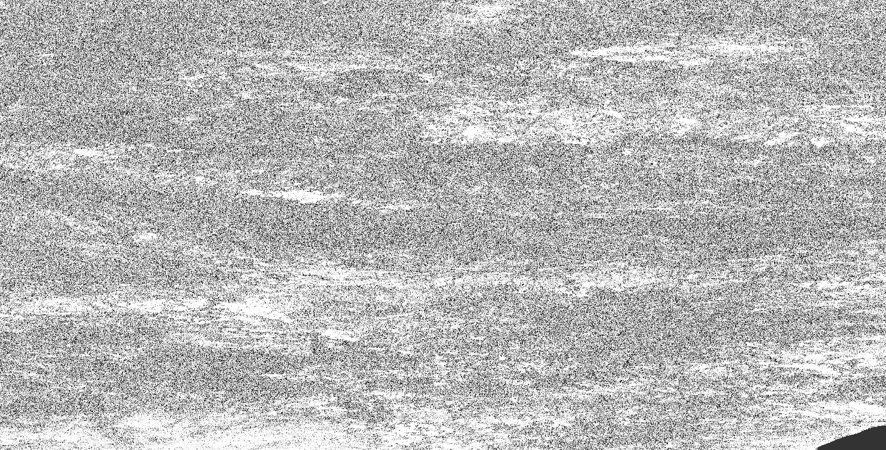
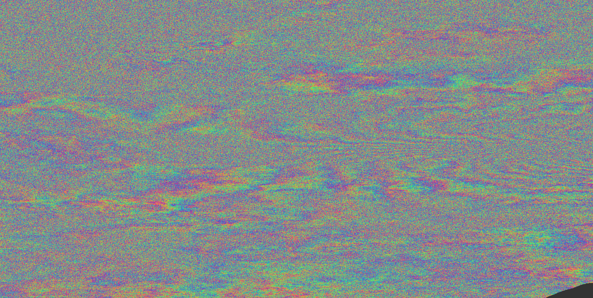
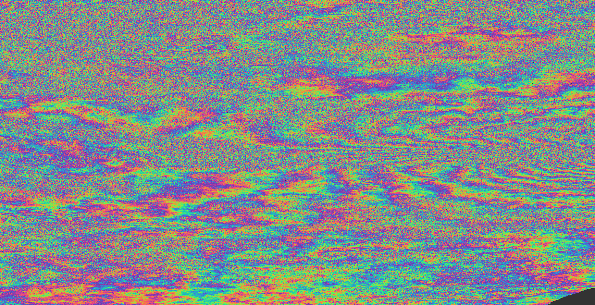

# Phase Linking — User Tutorial

**Distributed-Scatterer InSAR of the 2026 Venezuela earthquake, in SNAP Desktop and from the command line.**

*This is a hands-on tutorial built on a real Sentinel-1 dataset. For the algorithm and the design rationale, read the companion `Phase-Linking-Explained.md`.*

---

## Scenario

In June 2026 an earthquake struck Venezuela. We have **three Sentinel-1 acquisitions** over the epicentral area, spanning the event, from three satellites of the Sentinel-1 constellation:

| Role | Satellite | Acquisition |
|------|-----------|-------------|
| Reference / early | Sentinel-1A | **23 Jun 2026** |
| Early | Sentinel-1C | **24 Jun 2026** |
| Late | Sentinel-1D | **30 Jun 2026** |

Download the three products (free, by name) from the **Copernicus Data Space Ecosystem** (<https://dataspace.copernicus.eu>) or **ASF Vertex** (<https://search.asf.alaska.edu>) into a working folder of your choice. We process polarisation **VV**, subswath **IW3** throughout. The full product names:

```text
S1A_IW_SLC__1SDV_20260623T225050_20260623T225120_065103_0834C8_BAD5.SAFE
S1C_IW_SLC__1SDV_20260624T224958_20260624T225025_008254_010515_304A.SAFE
S1D_IW_SLC__1SDV_20260630T225009_20260630T225040_003472_006226_2543.SAFE
```

SNAP reads either the unzipped `.SAFE` folder or the downloaded `.zip` directly.

The three passes bracket the earthquake, so the coseismic (and early post-seismic) deformation accumulates across the stack.

Much of the epicentral terrain is vegetated and rural — **distributed scatterers**, where a single interferogram is too decorrelated to trust. That is exactly what phase linking is for: it recovers a usable, coherent phase history over those surfaces so the deformation fringes come through cleanly.

## What you will do

1. Build a **coregistered SLC stack** from the three acquisitions (IW3 / VV).
2. Run **`PhaseLinking`** to turn it into a phase-linked stack + a temporal-coherence quality band.
3. Form an interferogram and see the distributed-scatterer coherence gain.

You will do the Phase Linking step twice: once in **SNAP Desktop**, once with **`gpt`**.

## Why phase linking here

A single repeat-pass interferogram is noise over natural surfaces — scattering changes between passes. Phase linking jointly estimates **one consistent phase per acquisition** from the whole stack, so vegetated/rural pixels become usable instead of being discarded (as classical Persistent-Scatterer InSAR does). The output is a **drop-in replacement** for the coregistered stack — Interferogram, Multi-Master InSAR and SBAS all work unchanged, but distributed-scatterer coherence is far higher.

> **Note on stack size.** Three acquisitions is the **minimum** phase linking accepts (it needs ≥ 3 epochs). It cleanly demonstrates the workflow, but the coherence gain and time-series quality grow with more passes — add further acquisitions for an operational deformation product.

## Prerequisites

- **SNAP 14+** with the SNAP Microwave Toolbox. Confirm the operator:
  ```
  gpt PhaseLinking -h
  ```
  If it prints *"Unknown operator"*, update the SNAP Microwave Toolbox.
- The three Sentinel-1 SLC products listed above, downloaded to a working folder.
- Internet access for auto-downloaded precise orbits and the Copernicus 30 m DEM.
- ~40–50 GB free disk (the raw SLCs are ~8 GB each; the IW3/VV stack and phase-linked output are much smaller).

---

## Part A — SNAP Desktop (GUI)

### Step 1 — build the coregistered stack (IW3 / VV)

Phase Linking needs a coregistered, **debursted** complex stack. Build it from the three raw SLCs with this operator chain (the earliest pass, **S1A / 23 Jun**, is the reference):

```
Apply-Orbit-File  →  TOPSAR-Split (IW3, VV)   ×3 (one per acquisition)
        →  Back-Geocoding (S1A reference + S1C, S1D secondaries)
        →  Enhanced-Spectral-Diversity
        →  TOPSAR-Deburst
        →  coregistered stack
```

The quickest reliable way in the GUI is **Tools ▸ Graph Builder**: add three `Read` nodes (one per `.SAFE`), wire each through `Apply-Orbit-File` and `TOPSAR-Split` (set **Subswath = IW3**, **Polarisation = VV**), feed all three into `Back-Geocoding`, then `Enhanced-Spectral-Diversity`, `TOPSAR-Deburst`, and `Write`. Run it. *(If you prefer, run the `gpt` graph in Part B Step 1 — it is the exact same chain and is easier to reproduce.)*

> Restrict to the bursts covering the epicentre (TOPSAR-Split *First/Last Burst Index*) to cut processing time; leave them at the defaults to keep the whole subswath.

### Step 2 — Phase Linking

1. **Open the stack** produced in Step 1 (*File ▸ Open Product…*).
2. **Launch the operator.** Menu **Radar ▸ Interferometric ▸ Phase Linking ▸ Phase Linking** (the action sits inside a submenu of the same name). The dialog title is *"Phase Linking (DS InSAR)"*.
3. **I/O Parameters tab.** Source = the coregistered stack; target name gets suffix `_PL`; keep `BEAM-DIMAP`.
4. **Processing Parameters tab** — defaults are sensible; the ones worth setting for this scene:

   | Field | Default | For this scene |
   |-------|---------|----------------|
   | Window Azimuth / Range | 21 / 7 | Fine to start; enlarge over large fields for more looks |
   | SHP Test | KS | Keep KS |
   | SHP alpha | 0.05 | Keep |
   | Minimum SHPs | 20 | Keep (effective floor is raised to the stack size, 3, automatically) |
   | Estimator | EVD | Try **EMI** if the vegetated flanks stay noisy |
   | Reference Epoch (ddMMMyyyy) | *(empty = median)* | Empty → **24Jun2026** (the S1C pass). Set to `23Jun2026` to make the pre-event pass the datum |
   | Temp. Coherence Threshold | 0.6 | Keep; raise to 0.7 for a cleaner mask |
   | Output Temporal Coherence | on | Keep — this is your quality band |
   | Output SHP Count | off | Turn on to check you are gathering enough looks |

5. **Run.** Output is a `<name>_PL` product.
6. **Check quality first.** Open the **`tempCoh_VV`** band. Bright (high) values over the epicentral area mean the model fits well there. If large areas are dark, enlarge the window or try EMI.
7. **Continue the InSAR chain.** Treat the `_PL` product exactly like a normal coregistered stack and run the standard deformation chain on it. Because phase linking changed only the phase, this is the *same* graph you would run on a raw stack — the difference is that the distributed-scatterer areas now stay coherent all the way through.

   1. **Interferogram Formation** — *Radar ▸ Interferometric ▸ Products ▸ Interferogram Formation*. In the *Processing Parameters* tab:
      - Keep **Subtract flat-earth phase** ticked (removes the reference-ellipsoid fringes).
      - **✔ Tick "Subtract topographic phase".** This simulates the topographic fringes from a DEM (Copernicus 30 m by default) and removes them, so the interferogram shows **deformation + residual atmosphere** instead of topography. For an earthquake deformation study this box is essential — leave it **off** and the coseismic signal is buried under topographic fringes.
      - Keep **Include coherence** ticked so the coherence band is produced alongside the phase.
   2. **Goldstein Phase Filtering** — *Radar ▸ Interferometric ▸ Filtering* — to reduce phase noise before unwrapping.
   3. **SnaphuExport → SNAPHU (external) → SnaphuImport** — unwrap the filtered phase.
   4. **Phase to Displacement** — convert the unwrapped phase to line-of-sight displacement (metres).
   5. **Range-Doppler Terrain Correction** — geocode the displacement map to a map projection for interpretation/overlay.

   The result is a geocoded coseismic displacement map over the epicentral area, with usable signal over the vegetated terrain that a single raw interferogram could not resolve.

---

## Part B — Command line (`gpt`)

Run these from your working folder. The graph takes the three input products as parameters (`-Ps1a=`, `-Ps1c=`, `-Ps1d=`), so no paths are hard-coded — point them at wherever you downloaded the data.

### Step 1 — build the coregistered stack

Save as `venezuela_stack.xml`. Reference (master) is **S1A**; secondaries are **S1C** and **S1D**:

```xml
<graph id="VenezuelaStack">
  <version>1.0</version>

  <!-- ==== S1A (reference, 23 Jun) ==== -->
  <node id="Read_A"><operator>Read</operator><sources/>
    <parameters><file>${s1a}</file></parameters>
  </node>
  <node id="Orbit_A"><operator>Apply-Orbit-File</operator>
    <sources><sourceProduct refid="Read_A"/></sources>
    <parameters><orbitType>Sentinel Precise (Auto Download)</orbitType><continueOnFail>false</continueOnFail></parameters>
  </node>
  <node id="Split_A"><operator>TOPSAR-Split</operator>
    <sources><sourceProduct refid="Orbit_A"/></sources>
    <parameters><subswath>IW3</subswath><selectedPolarisations>VV</selectedPolarisations></parameters>
  </node>

  <!-- ==== S1C (24 Jun) ==== -->
  <node id="Read_C"><operator>Read</operator><sources/>
    <parameters><file>${s1c}</file></parameters>
  </node>
  <node id="Orbit_C"><operator>Apply-Orbit-File</operator>
    <sources><sourceProduct refid="Read_C"/></sources>
    <parameters><orbitType>Sentinel Precise (Auto Download)</orbitType><continueOnFail>false</continueOnFail></parameters>
  </node>
  <node id="Split_C"><operator>TOPSAR-Split</operator>
    <sources><sourceProduct refid="Orbit_C"/></sources>
    <parameters><subswath>IW3</subswath><selectedPolarisations>VV</selectedPolarisations></parameters>
  </node>

  <!-- ==== S1D (30 Jun) ==== -->
  <node id="Read_D"><operator>Read</operator><sources/>
    <parameters><file>${s1d}</file></parameters>
  </node>
  <node id="Orbit_D"><operator>Apply-Orbit-File</operator>
    <sources><sourceProduct refid="Read_D"/></sources>
    <parameters><orbitType>Sentinel Precise (Auto Download)</orbitType><continueOnFail>false</continueOnFail></parameters>
  </node>
  <node id="Split_D"><operator>TOPSAR-Split</operator>
    <sources><sourceProduct refid="Orbit_D"/></sources>
    <parameters><subswath>IW3</subswath><selectedPolarisations>VV</selectedPolarisations></parameters>
  </node>

  <!-- ==== coregister (master = first source), ESD, deburst ==== -->
  <node id="BackGeocoding"><operator>Back-Geocoding</operator>
    <sources>
      <sourceProduct refid="Split_A"/>
      <sourceProduct.1 refid="Split_C"/>
      <sourceProduct.2 refid="Split_D"/>
    </sources>
    <parameters>
      <demName>Copernicus 30m Global DEM</demName>
      <resamplingType>BISINC_5_POINT_INTERPOLATION</resamplingType>
      <maskOutAreaWithoutElevation>false</maskOutAreaWithoutElevation>
    </parameters>
  </node>
  <node id="ESD"><operator>Enhanced-Spectral-Diversity</operator>
    <sources><sourceProduct refid="BackGeocoding"/></sources>
    <parameters/>
  </node>
  <node id="Deburst"><operator>TOPSAR-Deburst</operator>
    <sources><sourceProduct refid="ESD"/></sources>
    <parameters><selectedPolarisations>VV</selectedPolarisations></parameters>
  </node>
  <node id="Write"><operator>Write</operator>
    <sources><sourceProduct refid="Deburst"/></sources>
    <parameters><file>${output}</file><formatName>BEAM-DIMAP</formatName></parameters>
  </node>
</graph>
```

Run it, pointing the three parameters at your downloaded products (increase heap for three full SLCs):

```
gpt venezuela_stack.xml ^
    -Ps1a=S1A_IW_SLC__1SDV_20260623T225050_20260623T225120_065103_0834C8_BAD5.SAFE ^
    -Ps1c=S1C_IW_SLC__1SDV_20260624T224958_20260624T225025_008254_010515_304A.SAFE ^
    -Ps1d=S1D_IW_SLC__1SDV_20260630T225009_20260630T225040_003472_006226_2543.SAFE ^
    -Poutput=stack_IW3_VV.dim -c 12G -q 8
```

### Step 2 — Phase Linking

Save as `venezuela_phaselinking.xml`:

```xml
<graph id="VenezuelaPL">
  <version>1.0</version>
  <node id="Read"><operator>Read</operator><sources/>
    <parameters><file>${input}</file></parameters>
  </node>
  <node id="PhaseLinking"><operator>PhaseLinking</operator>
    <sources><sourceProduct refid="Read"/></sources>
    <parameters>
      <windowAzimuth>21</windowAzimuth>
      <windowRange>7</windowRange>
      <shpTest>KS</shpTest>
      <shpAlpha>0.05</shpAlpha>
      <shpMin>20</shpMin>
      <estimator>EVD</estimator>
      <referenceEpochDate>24Jun2026</referenceEpochDate>
      <tempCohMin>0.6</tempCohMin>
      <coherenceBiasCorrection>false</coherenceBiasCorrection>
      <outputTempCoherence>true</outputTempCoherence>
      <outputShpCount>true</outputShpCount>
    </parameters>
  </node>
  <node id="Write"><operator>Write</operator>
    <sources><sourceProduct refid="PhaseLinking"/></sources>
    <parameters><file>${output}</file><formatName>BEAM-DIMAP</formatName></parameters>
  </node>
</graph>
```

```
gpt venezuela_phaselinking.xml -Pinput=stack_IW3_VV.dim -Poutput=stack_PL.dim
```

Leave `<referenceEpochDate>` empty to let it default to the chronological median (also `24Jun2026` here), or set `23Jun2026` to make the pre-event pass the zero-phase datum.

Or run `PhaseLinking` as a single operator on the stack:

```
gpt PhaseLinking -Pestimator=EVD -PtempCohMin=0.6 ^
    -SsourceProduct=stack_IW3_VV.dim ^
    -t stack_PL.dim
```

> **`-S` source key.** The name after `-S` must be the operator's source-product field name — for `PhaseLinking` that is `sourceProduct` (it declares no `source` alias, unlike many other operators). You can also pass the input positionally: `gpt PhaseLinking … stack_IW3_VV.dim`.

### Step 3 — interferogram + the coherence gain

Form the first interferogram (S1A→S1C, the first consecutive pair) from the phase-linked stack and, for comparison, from the raw stack:

```xml
  <node id="Interferogram"><operator>Interferogram</operator>
    <sources><sourceProduct refid="Read"/></sources>
    <parameters>
      <subtractFlatEarthPhase>true</subtractFlatEarthPhase>
      <subtractTopographicPhase>true</subtractTopographicPhase>
      <demName>Copernicus 30m Global DEM</demName>
      <includeCoherence>true</includeCoherence>
    </parameters>
  </node>
```

The **`subtractTopographicPhase`** flag is the command-line equivalent of the *Subtract topographic phase* checkbox in the GUI — it removes the DEM-simulated topographic fringes so the deformation signal remains. Point `Read` at `stack_PL.dim` for the phase-linked result and at `stack_IW3_VV.dim` for the raw baseline, and compare the coherence bands over the vegetated flanks — the phase-linked coherence should be markedly higher (see **Results** below for the temporal-coherence map and the before/after interferograms).

For the full time-series workflow (Multi-Master network → SNAPHU unwrapping → SBAS inversion), see the notebook **`snap-nb-sar-ds-insar-timeseries`**.

---

## Results

### Phase-linking temporal coherence



The `tempCoh_VV` band is phase linking's own **quality map**. For every pixel it scores, on a **0–1** scale, how well a *single* consistent per-epoch phase history explains *all* the pairwise phases in that pixel's covariance matrix (a Pepe–Lanari goodness-of-fit). **Bright** pixels (near 1) are where the distributed-scatterer model fits well and the estimated phase is trustworthy; **dark** pixels (near 0) are where it does not — open water, layover/shadow, or terrain too heterogeneous to gather enough SHPs. It is not a coherence between two dates; it is a whole-stack consistency measure. Use it as a mask — keep pixels above ~0.6–0.7 and discard the rest before unwrapping.

### Interferogram: before vs after phase linking

Both images below are the **same interferometric pair, formed identically** — the only difference is whether phase linking was applied to the stack first.





**Why the phase-linked fringes are so much cleaner.** Over distributed scatterers the raw single-pair phase (first interferogram) is dominated by speckle: the scattering rearranges between passes, so each pixel's phase is largely random and the fringe pattern is buried in noise. Phase linking replaces each pixel's noisy single-pair phase with a **maximum-likelihood estimate computed jointly** from *all* N(N−1)/2 interferometric phases in the stack, using the pixel's statistically-homogeneous neighbours (SHPs) as looks. That averaging collapses the per-pixel phase noise while preserving the underlying geometric signal, so the spatially-continuous fringes emerge (second interferogram). In short: the raw interferogram shows **one noisy observation** per pixel, while the phase-linked one shows the **stack's best joint estimate** — the same reason the average of many measurements is far less noisy than a single one. This is the coherence gain that makes distributed-scatterer areas usable for deformation mapping.

---

## Reading the output

| Band | Meaning |
|------|---------|
| `i_pl_IW3_VV_<date>` / `q_pl_IW3_VV_<date>` | Phase-linked complex pair per epoch (original amplitude, estimated phase). The reference epoch (24 Jun 2026) is written real-valued (zero-phase datum). |
| `tempCoh_VV` | Temporal (goodness-of-fit) coherence, 0–1. Your quality mask — keep ≥ ~0.6–0.7. |
| `numSHP_VV` | (optional) SHP count per pixel — diagnostic for whether the window gathered enough looks. |

> Bands carry the polarisation suffix (`_VV`) because the data is polarised; the bare `tempCoh` / `numSHP` names only appear for an untagged stack.

## Troubleshooting

| Symptom | Cause / fix |
|---------|-------------|
| *"requires debursted TOPS SLC input"* | Run `TOPSAR-Deburst` before Phase Linking (Step 1 already does). |
| *"need at least 3 epochs"* | All three acquisitions must be in the stack — check Back-Geocoding took S1A + S1C + S1D. |
| Coregistration looks poor / ESD fails | Confirm all three cover the same IW3 bursts and track; the constellation passes must share the relative orbit. Restrict to overlapping bursts in TOPSAR-Split. |
| Output looks identical to input everywhere | Every pixel was **passed through** — usually the window is too small to reach the stack-size floor over your area; enlarge it. |
| Vegetated flanks stay noisy (low `tempCoh_VV`) | Enlarge the window; try `estimator=EMI`; confirm the area is a distributed scatterer, not water/nodata. |
| Out-of-memory building the stack | Raise the gpt cache/threads (`-c 12G -q 8`) and close other apps; the three raw SLCs are ~8 GB each. |

## Next steps

- **Jupyter notebooks** — full, runnable SAR/InSAR workflows: <https://github.com/senbox-org/snap-jupyter-notebooks>. See `snap-nb-sar-ds-insar-timeseries` for the complete DS-InSAR time series (Phase Linking → Multi-Master network → SNAPHU unwrapping → SBAS inversion → velocity/displacement).
- Algorithm & parameter rationale: `Phase-Linking-Explained.md`.
- Operator parameter reference: in-app Help (F1 in the dialog) → *Phase Linking*.
